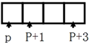
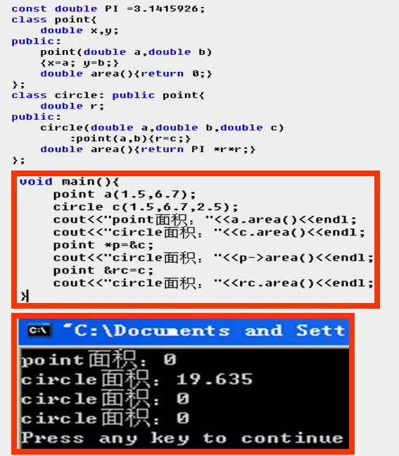

# 01 认识C++ 对象

## 初识C++函数和对象

C++ 以cpp为文件扩展名；有且必须只有一个main主函数；

C++在导入头文件时，不需要扩展名；

### C++的注释

```cpp
// 单行注释

/*
    多行注释
    多行注释
*/
```

### C++的输入cin和输出cout流

```cpp
// 输出；endl：输出后换行，可以使用换行符 "\n" 代替
cout << "这句话将输出到屏幕上显示" << endl;
cout << "这句话将输出到屏幕上显示" << "\n";

// 输入，cin后面跟存放的对象，如变量等
int x, y;
cin >> x >> y;         // 这等价于：cin >> x;  cin >> y;
```

### c++的命名空间【考点】

C++标准类库中的对象和函数都属于`std`命名空间

使用这些对象和函数时要`using namespace std`

c写法：

```c
#include "iostream.h"       // 包含头文件，c中包含后缀 .h
#include "math.h"
// using namespace std;
```

c++写法：

```cpp
#include "iostream"       // 包含头文件，c++中不能加后缀       【考点】
#include "cmath"
using namespace std;
```

### 对象定义和初始化

```cpp
// 对象x的初始化：·
int x;
x = 10;
// 等价于
int x = 10;
// 或者
int x(10);         // 构造函数语法 的写法
```

### 函数原型和返回值

函数：
```cpp
float result(float a, float b){
    float d;
    d = sqrt(a * a + b * a);
    return d;
}
```
其对应的函数原型声明：

>   函数调用在函数定义之前时要对函数进行声明

```cpp
// 函数原型的声明：
float result(float a, float b);
// 或
float result(float, float);

// 主函数
void main(){
    // ...
    z = result(a.x, a.y);
    // ...
}

// 函数
float result(float a, float b){
    float d;
    d = sqrt(a * a + b * a);
    return d;
}
```

### const修饰常量符合预处理

```cpp
#define PI 3.1415            // 预处理的写法
const int PI = 3.1415;          // 在变量前加上const后，该PI就是常量了，一经初始化，就不能再改变了，只读属性
const int PI(3.1415);
```

>   *   变量定义之前加上const关键字，表示定义的变量值不可改变。
>   *   #define：原样替换掉程序中出现的预定义宏名符号 PI
>   *   尽量选择const关键字来定义常量

const特点：定义常量时必须给出值，除非该常量时extern

>   C++预处理命令：以#开始，可能为 **宏定义** 或 **文件包含** 或 **条件编译**

测验：

*   写出 **C语言** 中预处理命令有哪些，举例说明每个命令含义及作用
*   写出C语言和C++语言中#include命令的不同处

### 变量的声明和初始化

```c++
// 声明变量x
int x;    // C语言中：x称为定义变量    C++中：x称为定义对象

// 初始化
int x = 123;     // 旧的方式
int x(123);      // 新的方式：构造函数语法
int x (123);
```

变量的使用：先声明后使用，函数也如此；

原型声明函数

### 宏定义 #define 定义常量

建议不要使用宏定义；应该用const来代替宏定义来定义常量；

用关键字const定义的常量，称为符号常量；

常量必须在声明时对符号常量初始化；

### 预处理器

不是C++编译的一部分，其主要是分析处理几种特殊的语句，主要在编译前执行“占位符替换”；

预处理器都以 首行字符 “#” 开始；

预处理器分3种：宏定义、文件包含和条件编译；

### 变量的称呼

```cpp
int x;    // C语言中：x称为定义变量    C++中：x称为定义对象
```

### 升级，结构体的使用

```cpp
struct point{
    float x;
    float y;
}

// point是数据类型，使用方式和int一样
struct point p1;
// 或
point p1;
```
学生结构体
```cpp
struct student{
    int num;
    char name[10];
    float grade;
}

struct student s1;
```

### 例子：求距离

**输入的点（x,y）到原点（0,0）的距离**

```cpp
#include "iostream"             // 预处理写法
#include "math.h"
using namespace std;             // 命名空间

float result(float, float);             // 声明函数
const int k = 2;             // 声明常量k并初始化为2
struct point{             // 定义结构体
    float x;             // float：浮点型
    float y;
}

void main(){             // 主函数 main
    float z(0);             // 定义并初始化z变量为0
    point a;             // 定义a对象，用于存放点数据的对象
    cout << "输入两个实数（用空格隔开）：" << endl;             // 向控制台输出信息显示
    cin >> a.x >> a.y;             // 获取从控制台输入的信息，赋值给a.x和a.y
    z = result(a.x, a.y);             // 调用result函数，将点坐标传入到函数内执行
    cout << "距离为：" << z << endl;             // 向控制台输出信息显示
}

float result(float a, float b){             // 求点到原点的距离函数
    return sqrt(a * a + b * b);
}
```

## 认识C++语言的面向过程编程特点

C语言是典型的面向过程语言，而C++既可以是面向过程，也可以是面向对象的语言，混合语言；

### 函数重载

一个函数定义多个版本，来完成多个功能，即：同一个函数名定义多个版本；

实现的核心：函数名相同，不同的参数个数或参数类型

典型例子：

```cpp
cout << max(1, 2) << max(1.1. 2.6) << max(8, 9, 7) << endl;
// 输出：   2                 2.6             9
```

其可能是这么实现的：

```cpp
int max(int a, int b){
    return a > b ? a : b;
}
int max(int a, int b, int c){
    int t;
    t = a > b ? a : b;
    return t > c ? t : c;
}
int max(double a, double b){
    return a > b ? a : b;
}
```

### 新数据类型

```cpp
void main(){
    cout << "haha";
}
```

void 类型：表示 无类型、空类型、函数无返回值；只能用于函数返回值上；

bool类型：占1字节，真或假

整型：short（16）、int（16）、long（32）

字符char类型：占1字节

>   注意：没有 String 类型、其是在 头文件 string 中定义的一个类


查类型在内存中占多少字节：

```cpp
sizeof(int)      // 16
```

### 取地址符 &

取地址运算符&用来取对象存储的首地址；

取变量x的首地址：

```cpp
int x = 56;      // vc6中，int以4字节存储对象56，假设存放的内存首地址用十六进制表示为"006AFDEC"
cout << &x;          // 取x所在的内存地址，以十六进制输出首地址： 006AFDEC
int *p;       // p：指针变量，用于存放变量的地址
// 即：
p = &x;
```

### 指针

```cpp
double *p;     
// *p：表示声明一个double类型的指针； 表名指针所指向的空间
// p表示指针变量，用于存储内存地址的
```

### 常量

C++中，整数常量有4种类型：**十进制常量、长整型常量、八进制常量和十六进制常量**；

整型：

-   0前缀表示8进制数，0x前缀表示16进制，如：   0L    05     0x5     0xaf

-   加L、l后缀表示长整型常量 long，如：   123l   456L

实型：

-   F、f后缀表示浮点型常量（float），如：   12.3f    4.56F
-   实数加L、l后缀表示long double型，如：0.5L    4L
-   无后缀，无后缀的为double型，如：3.14    6.2     4.

### 转义字符

...

### 动态分配内存

通过 new 方式来动态分配内存，格式：

`指针变量 = new 类型[size];`

new 运算符得到新分配空间的首地址，赋值给指针变量后，可根据指针变量的加减运算来使用这些空间。

```cpp
double *p;      // 声明一个double类型的指针，用于存放double类型的内存地址
p = new double[3];          // 分配3个double类型数据的存储空间
for(int i = 0; i < 3; i++){
    cin >> *(p + i);
}
for(i = 0; i < 3; i++){
    cout << *(p + i) << "  ";
}
delete p;
```



>   使用完毕后要释放内存：delete
>
>   delete p；

### 引用的使用方法

引用：即 对已有变量起一个别名。

定义形式：`数据类型 &别名=对象名`

& 符号为 `取地址` 符号；

特点：别名与对象名对应同一个对象，共用同一段内存。对别名的修改会造成原对象的修改。例如：

```cpp
int x;
int &a = x;           // 相当于： int &a = 0012FF7C;
// 表示：a是变量x的别名。
// 别名a和对象x完全等价，修改a相当于修改x
```

例子：

```cpp
int x = 56;
int &a = x;
int &r = a;
r = 25;        // 修改别名r，相当于修改了别名a，也就相当于修改了x

cout << x << a << r << &x << &a << &r << endl;
        25   25   25   0013ff7c   0013ff7c   0013ff7c      // 发现x/a/r的地址都相同，指向的都是同一个地址
```

下面写法错误：

```cpp
int& &r = x;      // 不能定义引用的引用

int x[5] = {1,2,3,4,5}
int &a = x;         // 不能直接定义数据组的引用

// 但可以间接定义数组的引用
typedef int A[5];
A a = {1,2,3,4,5};
A &b = a;
a[2] = '6';
for(int i = 0; i < 5; i++){
    cout << b[i] << " ";
}
```

### 对指针使用const限定符

左值和右值

`E1 = E2`  E1为左值、左操作数，可**被修改**和**被计算**；

-   &a不能当左值，除非 a 是指针，或者是 int & a（起别名）
-   *p 可以当左值，因为这是指针所引用的值赋值


-   **指向常量**的**指针**：在非 常量指针 声明前面使用const，即：const int * p;
-   常量指针：把const限定符放在 * 号右边，即：int  * const  p;
-   **指向常量**的**常量指针**：声明指针和指向的对象都不能改动的“指向常量的常量指针”，即：const int * const p;

>   需要搞清楚这三个的关系（会考）

指针常量的指针

指针不可以在等号左侧，但是指针常量可以：

```cpp
int x = 11;
const int *p;          // 错误，定义const时必须初始化值
const int *p = &x;        // 错误，指针 *p 不能在左侧
p = &x;       // 正确，指针常量p可以在等号左侧
```


指针常量和指向常量的常量指针

```cpp
int y = 58;
const int * p = &y;     // const针对的是 *，即指针指向的数，不能修改指向的值
int * const p = &y;     // const 针对的是 p，即指针本身，不能修改地址
```

### 泛型算法应用于普通数组

泛型算法是C++标准模板库（Standard Template Library）提供的一组操作。利用这些操作可以简化数组操作。

要使用这些操作必须包含头文件`<algorithm>`

```cpp
// 假设有a和b两个数组，其长度都为len

// 1、数组a的元素顺序反转(逆向)
reverse(a,a + len);

// 2、a数组原样复制给b数组
copy(a, a + len, b);

// 3、a数组元素反转并复制给b数组
reverse_copy(a, a + len, b);

int a[5] = {1,2,3,4,5};
// 4、升序排序
sort(a, a + len);

// 5、降序排序，   需要头文件：functional
sort(a, a + len, greater<int>());

// 6、在数组a中查找值为value的元素，并返回位置指针，   需要头文件：functional
find(a, a + len, value);
char a[5] = {'h','e','l','l','o'};
int * x = find(a, a+5, 'l');
if(x == a+5)   cout << "没有找到";
else cout << "找到l";

// 7、输出数组中的内容
copy(a+len, ostream_iterator<type>(cout,”字符串”));
ostream_iterator：输出流操作符
<type>：要输出的数组类型
Cout：流输出操作
“字符串”：分隔字符串
revrese_copy(a, a+len, ostream_iterator<type>(cout,”字符串”));   // 先输出后逆向
```

>   从0开始，包括0，完后len个，不包括第len个；

### 数据的简单输入输出格式

...以后再看...


# 02 从结构到类的演变

## 结构的演化

类是从结构演变而来的；

类和结构同级；

结构默认为public，类默认为private；

结构中有成员变量和成员函数

结构也有构造函数；

```cpp
struct Point{
    private:                  // private私有封装成员，只能在Point内部使用
    	double x, y;           // 成员变量
    public:       // 默认是public共有成员，这行可以不写
    	Point(){}                // 无参构造函数
    	Point(double a, double b){               // 有参构造函数
            x = a, y = b;
        }
    	Setxy(double a, double b){              // 函数成员
            x = a, y = b;
        }
}
void main(){
    Point a;              // 初始化一个a结构对象，调用了无参的构造函数
    Point b(18.5, 10.6);              // 初始化一个b结构对象，调用了有两个参数的构造函数
    a.Setxy(10.6, 18.5);
}
```

上面代码只要把struct改为class即可变成一个简单的类；

类有：类名Point、属性（数据成员）、具体操作的方法（成员函数）

C语言的结构化程序设计和C++的面向对象混合型语言；

## 面向过程与面向对象

...

## C++的面向对象程序特点

具有：抽象、封装、继承、多态

-   对象名：用于标识一个具体对象；
-   属性：用数据来表示对象的属性，一个属性就是描述对象静态特征的一个数据项，数据称为**数据成员**；
-   操作(方法/服务)：描述对象的动态特征（行为）的一个函数序列（使用函数实现操作），函数称为**成员函数**；

对象是构成系统的一个基本单位。一个对象是由一组属性和对这组属性进行操作的成员函数构成。

## 使用类和对象

即会介绍 string 类 和 complex 类

### string类

包含：多个不同参数的构造函数、成员函数find(检索需要的字串)、成员函数size(字符串长度)、成员函数substr(返回字符串中的字串)

使用该类需要：  `#include<string>`

```cpp
string str = 'A';        // 错误，必须是双引号
string str = "AB";      // 正确，  str[0]='A'           str[1]='B'

#include <iostream>
#include <string>
using namespace std;
void main(){
    string str1("Hello");
    string str2 = "World";             // 简写：string str1("Hello"), str2 = "World";
    count << "长度为：" << str1.size() << endl;          // 输出：5
}
```

**string的成员函数 substr**

substr(要截取字串在字符串中的位置，截取长度)

```cpp
string str = "We are here!We are here!";
string newstr = str.substr(3,3);          // are
newstr = newstr.substr(2,6);             // e  截取长度过大，会自动截到末尾
// newstr = str.substr(88,6);          // 起始位置过大，返回-1
```

**string的成员函数 find**

查找指定字串在字符串中的位置

对象.find(要查找的字串， 开始查找的位置)

```cpp
string str("you are big;")
int i = str1.find("are", 0);       // 4
```

找不到，返回-1，第二个参数默认为0，

**string的辅助函数  getline**

```cpp
string str;
getline(cin, str, '\n');
cout << "你输入了：" << str << endl;
```

练习：使用上面的函数，将May 28 ,2002转为 28 May 2002

### complex类

该类是一个模板类，用于定义复数的对象；需要包含头文件： `#include <complex>`

构造函数： complex(实部, 虚部)

模板类：即可定义多种数据类型的复数，如：实部和虚部的类型可以是整数、也可以是实数；

格式：` complex<数据类型> 对象名(实部值，虚部值);`

成员函数 real和imag用于输出实部值和虚部值

```cpp
complex <int> num1(1, 2);
complex <float> num2(3.5, 5.14);
cout << num2.real() << ","          // 输出： 3.5,
    << num2.imag()               // 5.14
    << endl;
```

## string对象数组与泛型算法

swap 交换对象中的属性；

```cpp
#include <iostream>
#include <string>
using namespace std;

int main() {
	string a = "a";
	string b = "b";
	a.swap(b);
	cout << a << " " << b << endl;        // b a
	return 0;
}

```

string类有一对用来指示其元素位置的begin和end的基本成员函数，分别是标识第一个元素和最后一个元素之后的结束位置；

| str1.begin() |      |      |      |      |      |      |      |      |      |      |      | str1.end() |
| ------------ | ---- | ---- | ---- | ---- | ---- | ---- | ---- | ---- | ---- | ---- | ---- | ---------- |
| w            | e    |      | a    | r    | e    |      | h    | e    | r    | e    | !    |            |

```cpp
int main() {
	string a = "abcdefg", b = a;       // a和b的值都为 abcdefg
	reverse(a.begin(), a.end());       // a 逆向，得到：  gfedcba
	copy(a.begin(), a.end(), b.begin());   // 将a复制给b， b得到：gfedcba
	cout << a << " " << b << endl;       // 最后a和b都输出为：gfedcba
	return 0;
}
```

>   在C++中，由string类定义的字符串中没有"\0"作为结束符，使用char数组定义的字符串则自动在尾部加上"\0"作为结束符；
>
>   在C语言中，没有string类，即使使用char数组定义的“字符串”自动在尾部加上"\0"作为结束符；

string数组

```cpp
#include <iostream>
#include <string>
#include <iterator>

using namespace std;

int main() {
	string str[] = { "we", "are", "lockey!" };
	for (int i = 0; i < 3; i++) {
		copy(str[i].begin(), str[i].end(), ostream_iterator<char>(cout));
		cout << endl;
	}
	str[0].swap(str[2]);
	str[0].swap(str[1]);
	for (int i = 0; i < 3; i++) {
		cout << str[i] << endl;
	}
	return 0;
} 
```


# 03 函数和函数模板

## 函数的参数及其传递方式

传值：**传变量值** 和 **传变量地址值**

函数参数传递方式：**传值** 和 **传引用**（即传对象的地址，也叫传地址方式）

需要区别：传地址值 和 传地址

传递对象地址值是使用对象指针作为参数；传递地址是使用对象引用作为参数；

函数参数可以用：对象、对象指针和对象引用 作为参数；

### 对象作为函数参数

单向的，形参是实参的备份，改变形参，不会影响实参；

>   实参：我们自己主动初始化的对象，例如：int i = 20;  i就是实参
>
>   形参：系统自动帮我们初始化的对象，例如：方法的参数

>   这里的对象作为函数参数的对象，可以是：基本数据类型、类和结构的对象，但是不能是 数组的值 作为函数参数，可以是数组的地址值作为参数，即使用指针作为参数。

```cpp
#include <iostream>
#include <string>
using namespace std;

void swap(string, string);
int main() {
	string str1("hi"), str2("c++");
	swap(str1, str2);
	cout << str1 << " - " << str2 << endl;       // hi - c++
	return 0;
} 
void swap(string s1, string s2) {
	string temp = s1; s1 = s2, s2 = temp;
	cout << s1 << " * " << s2 << endl;       // c++ - hi
}
```

### 对象指针作为函数的参数

将指向对象的指针作为参数，形参是对象指针，实参是对象的地址值，即：改变形参，也会改变实参；

数组名就是数组的指针名，即：数组能用传数组地址值的方式；

```cpp
#include <iostream>
#include <string>
using namespace std;

void swap(string*, string*);
int main() {
	string str1("现在"), str2("过去");
	swap(&str1, &str2);
	cout << str1 << " - " << str2 << endl;       // 过去 - 现在
	return 0;
} 
void swap(string * s1, string * s2) {
	string temp = *s1; *s1 = *s2, * s2 = temp;
	cout << *s1 << " * " << *s2 << endl;       // 过去 - 现在
}
```

数组名是数组指针名，数组指针名指向的是数组首地址，所以相当于传地址值：

```cpp
#include <iostream>
#include <string>
using namespace std;

void swap(int[]);
int main() {
	int a[] = { 7, 8 };
	swap(a);
	cout << a[0] << " - " << a[1] << endl;       // 8 - 7
	return 0;
} 
void swap(int a[]) {
	int temp = a[0]; a[0] = a[1], a[1] = temp;
	cout << a[0] << " * " << a[1] << endl;       // 8 - 7
}
```

### 引用作为函数参数

运行前，函数没有对形参初始化，即不知道形参是哪一个对象的别名；调用函数时，实参对象名传递给形参，形参对象名就是实参对象名的别名，实参对象名和形参对象名是同一个对象，改变形参就是改变实参；

```cpp
#include <iostream>
#include <string>
using namespace std;

void swap(string&, string&);
int main() {
	string str1("hello"), str2("world");
	swap(str1, str2);
	cout << str1 << " - " << str2 << endl;       // world - hello
	return 0;
} 
void swap(string&s1, string&s2) {
	string temp = s1; s1 = s2, s2 = temp;
	cout << s1 << " * " << s2 << endl;       // world - hello
}
```

>   为什么说用引用对象做函数的参数比对象指针好？
>
>   引用对象不是一个独立的对象，不单独占用内存单元，而对象指针要另外开辟内存单元（其内容值为地址），所以引用对象比对象指针做函数的参数更好；

数组不能作为引用，但是可以间接使用引用（前面有说到），即数组可以通过间接引用方法作为函数参数传递：

```cpp
#include <iostream>
#include <string>
using namespace std;

 typedef double AA[12];         // 自定义数组标识符 AA   声明间接数组类型
void avecount(AA& b, int n);

int main() {	
	AA b = { 12, 34, 56, 78, 90, 98, 76, 85, 64, 43 };
	AA & a = b;             // 间接引用数组
	avecount(a, 12);
	cout << "平均分：" << a[10] << "，不及格的人数： " << int(a[11]) << endl;
	return 0;
}

void avecount(AA&b, int n) {
	double ave(0);
	int count(0);
	for (int j = 0; j < n - 2; j++) {
		ave += b[j];          // 统计人数到 ave上
		if (b[j] < 60) count++;           // 小于60分不及格的统计到count上
	}
	b[n - 2] = ave / (n - 2);       // 计算平均分
	b[n - 1] = count;               // 计算不及格人数
}
```

### 默认参数

即：形参已经给定了一个默认的参数，调用时不需要特定为这个参数传值（如果不传就使用默认参数），如果需要特殊值传递，则需要显式地去指明

默认参数的形参必须放在参数序列最后面；

`int saveName(char *first, char *second = " ", char *third=" ");`

调用时，我们可以：

`saveName("A","B","C");`

或：

`saveName("A","B");`

或：

`saveName("A");`

### const修饰函数参数

用const修饰函数参数，表名函数体内只能使用这个只读函数，不能修改它；

```cpp
#include <iostream>
#include <string>
using namespace std;

void chang(const string&);
int main() {	
	string str("你能修改它么？");
	chang(str);
	cout << str << endl;
	return 0;
}
void chang(const string& s) {
	//s += "，不能";                  // 这里不通过编译，报错，因为变量s为const常量，只读，不能修改s的值
	string s1 = s + "，不能";
	cout << s1 << endl;
}
```

## 函数返回值

C++中的返回值类型可以是除数组和函数以外的所有类型，要返回数组的只能返回其地址；

返回值是指针或引用对象时：**函数返回所指向的对象必须继续存在，也就是不能用函数内部的局部对象作为函数的返回值（因为局部对象在函数结束时结束）**

###  返回值为引用类型的函数

目的：**为了将该函数用在赋值运算符 = 左边。**

```cpp
#include <iostream>
using namespace std;

int a[] = { 1,2,3,4,5,6,7,8 };
int& index(int i);
int main() {	
	index(6) = 16;             // 记住啊，函数也可以赋值，前提是返回值类型必须是一个引用，只有这一种情况才能在=左边
	cout << index(6) << endl;
	return 0;
}

int& index(int i) {
	return a[i];
}
```

### 返回值为指针类型的函数

函数的返回值可以是存储某种类型数据的内存地址（如变量地址、数组的首地址或指针变量的地址），这种函数称为指针函数；

格式：`类型标识符 *函数名(参数列表);`

```cpp
#include <iostream>
using namespace std;

float* input(int& n);

int main() {	
	int n;
	float* p = input(n);
	if (p) {    // 如果不为NULL时，doing...
		for (int i = 0; i < n; i++)
		{
			cout << p[i] << " ";        // 输出指针内的每一个值
		}
		delete p;        // 释放内存空间
	}
	return 0;
}
float* input(int& n) {
	cout << "请输入数据量：";
	cin >> n;
	if (n < 0) return NULL;
	float* buf = new float[n];        // 向内存申请n个float类型的内存空间
	if (buf == 0) return NULL;       // 申请失败，则结束
	for (int i = 0; i < n; i++) {
		cin >> buf[i];          // 从键盘输入指定的浮点值，每一个用空格隔开，结束按回车
	}
	return buf;         // 返回 buf 指针
}
```

### 返回值为对象类型的函数

```cpp
#include <iostream>
using namespace std;

string input(string n) {
	return n + ",666~";
}
int main() {
	cout << input("我真的是") << endl;
	return 0;
}
```


## 内联函数 inline

在函数前加上inline关键字，则这个函数就是内联函数；

**函数内不能有循环语句、switch语句，否则该函数不能作为内联函数来使用；**

内联函数的作用是**让编译器在遇到inline定义的函数时，将函数体内的语句组成一个表达式，替换在调用方内处；减少多次调用方法带来的性能损耗，加快程序的执行速度**；

```cpp
#include <iostream>
using namespace std;

inline string input(int num) {       // 此内联函数的定义必须放在第一次调用该函数之前
	return num > 5 ? "大于5" : "小于5";
}
int main() {
    int num = 6;
	cout << input(num) << endl;
	return 0;
}
```

使用inline关键字修饰成内联函数后，编译器最终会编译成：

```cpp
#include <iostream>
using namespace std;

int main() {
	int num = 6;
	cout << (num > 5 ? "大于5" : "小于5") << endl;
	return 0;
}
```

优点：提成执行效率，缺点：内联函数过多会增加代码大小；

>   重要、考点：编译器必须知道内联函数的函数体，才能进行内联替换，所以，内联函数的定义必须放在第一次调用该内联函数的语句前，不能使用函数原型声明的方式；

## 函数重载和默认参数

面向对象程序设计（OOP）的三大特性之一：多态性；

实现重载的条件：参数类型不同或参数个数不同；

>   返回值不同 不能成为函数重载的条件！！！必须注意；
>
>   int max(int, int);
>
>   string max(int, int);
>
>   这么写会报错的

源代码只声明函数调用，而不说明具体调用哪一个函数。编译器的这种连接方式称为动态联编或延迟联编；

动态联编：直到**程序运行时**才能确定调用哪一个函数（动态联编需要虚函数来支持）；例子：默认参数导致的动态联编！

静态联编/先期联编：**编译器在编译时**，能根据源代码调用固定的函数标识符，并用物理地址代替它们的；例子：平常的方法调用、函数重载等这些就是了；


## 函数模板

>   提示：函数的模板其实就相当于高级语言（Java/C#）的泛型（如果不知道泛型的话可以不用过多纠结）

特点：函数体内的逻辑功能一样，仅仅是类型不一样而已的函数，我们就可以使用函数模板；

```cpp
Type max(Type m1, Type m2){ 
    return (m1 > m2) ? m1 : m2; 
}
```

Type不是类型，只是一个占位符（也叫占位标识符），希望在编译器编译时，需要用实际的类型来替换它们；

-   函数模板：用实际的类型实例化该函数时的这函数；
-   模板函数：将函数模板与某个具体数据类型连用，就产生了模板函数；
-   函数模板实例化：产生模板函数的这一过程，形式上是类型参数化；

```cpp
template <class T>            // 这里的class 表示：用户定义的 或 固有的类型；注意这里不需要加分号 坑爹啊
T max(T m1, T m2){
    return (m1 > m2) ? m1 : m2; 
}
int main(){
    cout << max(1, 3) << "\t"           // 用 int 来初始化函数模板 max
        << max(1.1, .9) << "\t"            // 用 double 来初始化函数模板 m
        << max('a', 'w') << "\t"            // 用 char 来初始化函数模板 m
        << max("ABC", "ABD") << endl;            // 用 char[] 来初始化函数模板 m
}
```

在调用该函数时，就能推断出该函数模板是用哪一个类型来代替了；

complex模板类参数的重载函数示例：

```cpp
#include <iostream>
#include <complex>           // 需要包含 complex 头文件
using namespace std;

template <class T>             // 注意这里不需要加分号 坑爹啊
void printer(complex<T> a) {
	cout << a.real() << " - " << a.imag() << endl;
}

int main() {
	printer(complex<int>(3, 2));
	printer(complex<float>(3.2f, 3.7f));
	return 0;
}
```

#### 函数模板参数

```cpp
template <class T>            // 这里的class 表示：用户定义的 或 固有的类型
T max(T m1, T m2) {
	return (m1 > m2) ? m1 : m2;
}
void main(){
    cout << max<int>(11, 22)
        << max(11,22)
        << endl;
}
```

调用的方式：显式的`max<int>(11, 22)` 和 隐式的`max(11, 22)` 等价；

显示调用方式可以解决函数类型自动转换的问题；

```cpp
#include <iostream>
using namespace std;

template <class T>            // 这里的class 表示：T是 用户定义的 或 固有的类型
T max(T m1, T m2) {
	return (m1 > m2) ? m1 : m2;
}
int main() {
	cout << max<int>(1, 3.2) << "\t"           // 正确，指明了int类型，3.2 会被自动转换为 3
		<< max(1, 3.2) << "\t"            // 异常，因为无法推断T的类型是int还是double
		<< endl;
}
```

模板多重声明：`template <class T, class T2>`


#### 显示规则和关键字 typename

typename 的作用目前不清楚。。。


# 04 类和对象

**对象是类的实例，类是对象的抽象；**

**将一组对象的共同特征抽象出来，从而形成 类** 的概念；

## 定义类

类是由 ：**数据成员**和**成员函数**组成，统称类成员；

类成员都有一个访问修饰符，是其：private（私有）、public（共有）、protected（保护）三个中的一个，默认为private；

#### 声明类

```cpp
class Point{
    private:
        int x,y;
    public:
        void Setxy(int a, int b);      // 函数声明/函数原型，共有的
        void Display();      // 函数声明/函数原型，共有的
}
```

#### 定义成员函数

格式：

```cpp
返回值类型 类名::成员函数名(参数列表){
    成员函数的函数体 // 内部实现
}
```

`::`为作用域运算符，下面是个例子：

```cpp
void Point::Setxy(int a, int b){
    x = a;
    y = b;
}
```

也可以作为内联成员函数：

```cpp
inline int Point::Getx(){
    return x;
}
```

#### 类、成员函数、调用的使用

下面代码概括了怎么使用类和对象：

```cpp
#include <iostream>
#include <string>
using namespace std;

class Point {
	private:
		int x = 24, y = 33;
	public:
		void Setxy(int a, int b);
		int Getx();
		inline int Gety() {         // 在类内定义成员函数，称为：内联函数
			return y;
		}
		void Display() {
			cout << x << " - " << y << endl;
		}
		void print(Point& a) {                  // 这里，C++推荐使用引用传递方式 A&a 代替对象传递方式 A a
			a.Display();
		}
};

void Point::Setxy(int a, int b) {
	x = a, y = b;
}
int Point::Getx() {
	return x;
}

int main() {
	Point a;
	a.Setxy(11, 22);
	
	Point* p;
	p = &a;
	// 或： Point* p = &a;
	

	cout << p->Getx() << a.Gety() <<  endl;      // 对象通过 点 访问对象成员；对象指针名通过 -> 访问对象成员
	return 0;            
}
```

除了这个代码，还可以看下课本上的73页的代码，也挺经典的，看懂你就差不多会用了；

### 数据封装

面向对象是消息处理机制，对象之间只能通过**成员函数**调用实现互相通讯

对对象的数据成员和成员函数的访问是通过 访问控制权 来控制的，即访问修饰符：public、private、protected；

一般的，数据成员设置为私有，以便隐藏数据，将部分成员函数说明为共有，用于提供外界和这个类的对象互相作用的接口（界面），从而使其他函数（如main函数）也能访问和处理该类的对象。

## 构造函数

上面的代码简历的对象，其类内部的数据成员的状态（的值）是不确定的，我们需要在构造对象时，初始化类里面的数据成员，这就需要用到构造函数了；

没有为类定义任何构造函数时，C++编译器会自动建立一个不带参数的构造函数，即：

`Point::Point(){}`

>   注意：一旦我们定义了自己的构造函数，系统就不再提供默认的构造函数了；

下面代码演示了如何使用构造函数：

```cpp
#include <iostream>
#include <string>
using namespace std;

class Point {
	private:
		int x, y;
		string str;
	public :
		Point();
		Point(int);		
		Point(int, int);
		Point(string str1) :str(str1) {
			cout << "str:" << str << endl;
		};
        void Show(){
            cout << x << " - "<< y << endl;
        }
};
Point::Point() :x(0), y(0) {
	cout << "无参" << endl;
}
Point::Point(int a, int b) : x(a), y(b) {
	cout << x << " - " << b << endl;
}
Point::Point(int b) : x(0) {
	y = b;
	cout << y << endl;
}

int main() {
	Point A;    // 调用无参构造函数
	Point B(77, 88);    // 调用两个int类型参数的构造函数
	Point C(77);    // 调用一个int类型参数的构造函数
	Point D("hello");    // 调用一个string类型参数的构造函数
    Point E[2];           // 开辟两个Point类型的对象数组，即调用两次无参构造函数
	Point F[2] = { Point(5, 7), Point(8.9) };     // 同理调用两次无参构造函数,每次得到的对象赋给F对象数组
	return 0;
}
```

>   注意：构造函数不能我们主动去调用，而是系统调用，即我们需要新建对象时，系统会自动调用构造函数；

### 运算符 new

通过 new 创建的对象，返回的是该对象的指针；

```cpp
void main(){
    Point *point = new Point;
    Point *point2 = new Point(77, 88);
    point2 -> Show();
    delete point;        // 通过new创建的对象指针，需要良好的释放所占用的内存空间
    delete point2;
}
```

### 构造函数的默认参数

可以通过默认参数全部都默认后，省略写无参构造函数；不懂？看书~简单啊

### 复制构造函数

即：使用已有的对象复制建立出一个新的对象；

>   复制构造函数也是由系统自动调用的

浅拷贝：通常、编译器会建议一个默认复制构造函数，其采用拷贝方式使用以后对象来建立新对象，又称为：拷贝构造函数；

拷贝构造函数的原型：

`A::A(&A)`

从原型可知：他是一个构造函数、参数是引用的，既然是引用，那么我们就可改变原有的对象，但我们不能这么做，即更正的原型为：

`A::A(const &A)`   推荐用这个

根据上面的Point例子，修改成如何使用复制构造函数：

```cpp
class Point {
	private:
		int x, y;
		string str;
	public :
		Point();
		Point(const Point&);
		void Show() {
			cout << x << " - " << y << endl;
		}
};
Point::Point(): x(0), y(0) {
	cout << "无参" << endl;
}
Point::Point(const Point& p): x(p.x) {
	y = p.y;             // 我们发现，复制构造函数可以访问私有数据成员，这在复制构造函数中是可以的
	str = p.str;
}

int main() {
	Point D("hello");
	Point G(D);
	G.Show();
	return 0;
}
```


## 析构函数

即：使用析构函数来释放由构造函数分配的内存；

**析构函数**、**复制构造函数**和**构造函数**是构成构造型成员函数的基本成员；

>   析构函数也是系统自动调用的

-   析构函数与构造函数的区别：
-   在析构函数前加上一个 ~ 号用以区分构造函数；
-   析构函数不能有返回值，void都不行，也不能有参数，但可以显示的说明参数为void，函数名与类名一致；
-   一个类只能有一个析构函数

析构函数在对象已经不再使用的情况下自动调用！

### 定义析构函数

```cpp
#include <iostream>
#include <string>
using namespace std;

class Point {
	private:
		int x, y;
		string str;
	public :
		Point();
		Point(const Point&);
		~Point(void);
		void Show() {
			cout << x << " - " << y << " - " << str << endl;
		}
};
Point::~Point(void) {
	cout << "Destructor is active" << endl;
}
Point::Point() :x(0), y(0) {
	cout << "无参" << endl;
}
Point::Point(const Point& p): x(p.x) {
	y = p.y;
	str = p.str;
}

int main() {
	Point A;
	Point G(A);
	G.Show();
	return 0;
}
```

>   代码分析：上面代码中，构造了A对象，然后通过A对象复制创建了G对象，一共就有两个对象，当这两个对象的声明周期结束时，也就是发现A和G对象不再使用了，系统就会自动调用析构函数两次并输出 Destructor is active，以回收对象占用的内存。

>   全局对象 和 静态对象 在程序运行结束前调用析构函数；

### 运算符delete与析构函数

析构函数是与delete运算符一起使用的；

delete运算符：当使用delete删除一个动态对象时，会先为这个动态对象调用析构函数，然后再释放该动态对象所占的内存，这个new的功能相反；

```cpp
#include <iostream>
using namespace std;

class Point {
	public :
		Point();
};
Point::~Point(void) {
	cout << "Destructor is active" << endl;
}
Point::Point() :x(0), y(0) {
	cout << "无参" << endl;
}

int main() {
	Point* ptr = new Point[2];        // 申请2个Point类型的内存空间，调用无参构造函数两次
	delete[]ptr;        // [] 告诉编译器这个动态数组有多少个元素对象，delete会为每个动态数组元素执行一次析构函数，然后再逐个释放对象指向的内存空间
	return 0;
}
```

>   如果定义类时没有新建一个析构函数，则编译器会默认生成一个函数体为空的默认析构空间，即：
>
>   Point::~Point(){}

## 调用复制构造函数的综合案例（难点）

课本82页，看懂则这构造函数就过了

## 成员函数重载及默认参数

这也没啥好讲的，都是上面知识的总结，看懂源码就过关了：

```cpp
#include <iostream>
#include <string>
using namespace std;

class Max {
private:
	int a, b, c, d;
	int Maxi(int, int);
public:
	void Set(int, int, int, int);
	int Maxi();
} A[3];

int Max::Maxi(int x, int y) {
	return x > y ? x : y;
}
void Max::Set(int x1, int x2, int x3 = 0, int x4 = 0) {
	a = x1;
	b = x2;
	c = x3;
	d = x4;
}

int Max::Maxi() {
	int x = Maxi(a, b);
	int y = Maxi(c, d);
	return Maxi(x, y);
}

int main() {
	A[0].Set(11, 22, 33, 44);
	A[1].Set(36, 2.2, 37);
	A[2].Set(101,44);
	for (int i = 0; i < 3; i++) {
		cout << A[i].Maxi() << " ";
	}
	return 0;
}
```

## this指针

官方话：C++规定，当一个成员函数被调用时，系统自动向它传递一个隐含的参数，该参数是一个指向调用该函数的对象的指针，从而使成员函数知道该对哪一个对象进行操作；

我的话：假设有如下代码：

```cpp
class Point{
    private:
        int x, y;
    public:
        Setxy(int, int);
}
Point:: Setxy(int a, int b){
    x = a;
    y = b;
}

int main(){
    Point A;
    Point B;
    A.Setxy(11, 22);
    return 0;
}
```

当我们执行 `A.Setxy(11, 22)` 时，A.x和A.y就被赋值了，考虑下，为什么不是B.x和B.y被赋值呢？

因为在成员函数 Setxy(int, int) 有一个隐藏参数，名为this指针，该指针指向的是调用该函数的对象的地址，其编译后形式如下：

```cpp
Point::Setxy(int, int, (Point*)this){
    this -> x = a;
    this -> y = b;
}

A.Setxy(11, 22);       // 这里调用Setxy的是通过A对象，则上面的this指针所指向则是A对象的内存地址
```


## 一个类的对象作为另一个类的成员

有点难的代码，课本87页


## 类和对象的性质（重要）

### 对象的性质

-   同一类的各个对象可以互相赋值   `Pont A, B;   A.Setxy(1,2);   B = A;`
-   可使用对象数组；  `Point A [3];` 意为定义数组A可以存储3个Point类型的对象；
-   可使用指向对象的指针；     `Point *p = &A;    p -> Display();`  注意这里的A只能是Point类的对象，不能是变量、函数等；
-   对象可用作函数参数；
-   对象作为函数参数时，可使用对象、对象引用和对象指针；
-   一个对象可以作为另一个类的成员；

>   重载时，参数个数一致的情况下，对象、对象引用和对象指针只能使用一个；

### 类的性质

**使用类的权限：**

-   类本身的成员函数可以使用该类的所有成员（包括私有和共有 数据成员和成员函数）
-   类的对象只能访问共有的成员；
-   其他函数（非本类的成员函数）不能访问类中的私有和共有所有成员，只能通过类的对象访问其类的共有所有成员；
-   一个类可以包含另一个类的对象A，但这个类也只能通过在这个A对象使用所对应类的共有成员；

**不完全类的声明**

实例化：通过类产生对象，会分配内存空间，这种对象的建立的过程称为 实例化；
类没有完全定义之前就引用该类
不完全声明仅用于类和结构

**空类**

即类中啥都没有，编译时会提示警告，消除方式：自定义一个空体的无参构造函数：

```cpp
class A {
	public:
		A() {}
};
int main() {
	A a;
	return 0;
}
```

**类作用域**

1、类的大括号包围的所有代码都是类的作用域，类中声明的各种标识符在类外部不可见；

2、

```cpp
#include <iostream>
using namespace std;

class Point2 {
	private:
		int num;
	public:
		Point2();
		int getNum() {
			return num;
		}
};

int num;
Point2::Point2() {
	num = 123;        // 这个num是Point2里面，不是全局的
    // Point2::num = 123;        // 也可以这么显式的指示，这种称为：成员名限定
}

int main() {	
	Point2 a;
	cout << a.getNum() << endl;
	return 0;
}
```

>   类内的数据成员生命周期是由其对象生命周期决定的，对象存在，里面的数据成员存在，否则反之；

## 面向对象标记图

...

## 面向度夏宁编程的文件规范

每个类设立一个头文件.h和一个实现文件.cpp，在实现文件将头文件包含进去；头文件放类的声明，实现文件放实现类的声明的实现类；

### 编译指令

编译器对源代码编译前先执行预处理；

编译指令都以 #  开头，每条仅能占一行

编译指令不是C++的一部分

1.嵌入指令  #include

```cpp
#include <iostream>
#include <\user\prog.h>
#include "\user\prog.h"
```


2.宏定义    #define

#define PI

#define 用以宏定义PI

PI 标识符表示：宏名

替换过程表示：宏替换


3.条件编译指令

#if、#else、#elif、#endif

#endif 表示一条指令的结束

如果满足条件，则编译里面的内容，否则不编译里面的内容；

在#else分支中使用#error来输出错误信息；

`#error 错误信息`

当遇到#error时，会输出后面的 “错误信息”，然后中止程序编译；


4.defined操作符

这不是指令，而是预处理操作符，用于判定一个标识符是否已经被 #define 定义。被定义的返回true，否则false；

```cpp
#include <iostream>
using namespace std;

#define PI

int main() {
	int i = 55;
	#if defined(PI)
		cout << "有PI，PI已经被define了," << i << endl;
	#else
		cout << "PI没有被define~~~" << endl;
	#endif
}
```


#  05 特殊函数 和 成员

## 对象成员的初始化

类中的成员变量的类型如果是类，那么这个成员变量称为：对象成员；

要在构造函数被调用时初始化这些对象成员，方式如下：

```cpp
class A{
    private:
    	int a, b;     // 对象成员a、也叫成员变量a
    A(int i): a(i),b(6 > i ? 6 : i){        // 这么初始化对象成员a，其中i处可以放复杂的表达式，比如b成员变量这个
        // do something
    }
}
```

复制下面程序在IDE中调试看下执行顺序：

```cpp
#include <iostream>
using namespace std;

class object {
private:
	int val;
public :
	object() :val(0) {
		cout << "default constructor for object" << endl;
	}
	object(int i) : val(i) {
		cout << "constructor  for object" << endl;
	}
	~object() {
		cout << "destructor for object" << val << endl;
	}
};

class container {
	private:
		object one;
		object two;
		int data;
	public :
		container() :data(0) {
			cout << "default constructor for container" << endl;
		}
		container(int i, int j, int k);
		~container(void) {
			cout << "Desctructor for container" << data <<  endl;
		}
};

container::container(int i, int j, int k) : two(i), one(j) {
	data = k;
	cout << "Constructor for container ." << endl;
}

int main() {
	container obj, anObj(5, 6, 10);
}
```


## 静态成员

```cpp
#include <iostream>
using namespace std;

class A {
	static int x;       // 1、静态数据成员的声明，声明后需要在文件域中定义初始化
	static int y;
	int z;
public:
    static int j;
	A(){}
	A(int x, int y){
		A::x = x;             // 3、还能在本类中的构造函数中进行对静态成员变量的初始化
		A::y = y;
	}
	static int func() {
		return x;
	}
	static void sfunc(A& s, int a){
        // z = a;       // 报错，因为找不打z这个成员变量
		s.z = a;      // 这里为什么要这么做？因为静态成员函数内没有this指针，所以静态成员函数只能通过对象名（或指针对象的指针）访问该对象的非静态成员
	}
	int Getz() {
		return z;
	}
};

int A::x = 1;                 ///2、这里需要对类A中的静态成员变量初始化，这里是文件作用域，只能在文件作用域中初始化，不能在另一个类内或函数内初始化
int A::y = 2;
int A::j = 7;

int main() {
	A b, c;
	A::sfunc(b, 3);
	cout << b.Getz() << " ";
	cout << b.func() << " ";
	cout << c.func() << endl;
	A d(3, 4);
	cout  << d.func()<< " " << b.func() << " " << c.func();
    cout << b.j << endl;       // *静态成员可以被类或类对象调用*
}
```

静态成员是类成员，不是对象成员

类中的静态成员函数内没有this指针，所以静态成员函数只能通过对象名（或指针对象的指针）访问该对象的非静态成员；

静态成员函数 与 一般成员函数的区别：

-   不需要引用另一个对象，只与类名连用
-   在没有创建对象前，静态成员就已经存在了
-   静态成员是类的成员，不是对象的成员
-   静态成员为该类中的所有对象共享，它被存储于一个公用的内存中；
-   没有this指针，除非显示指示地把指针传递给它，否则不能存取类的数据成员；
-   静态成员函数不能被说明为虚函数
-   静态成员函数不能直接访问非静态函数

>   静态成员在编译运行的时候就已经分配内存空间了；
>
>   静态成员不会释放内存空间，只有程序运行结束时才会释放内存空间；
>
>   普通变量不初始化，其值为随机数、而静态变量不初始化，其值为默认值；
>
>   静态成员在整个程序运行过程中，只会初始化一次，而对于其对应的析构函数也是在程序结束时执行一次；

要理解 静态成员 和 静态对象 的区别、静态对象 和 析构函数 的调用特点；

```cpp
#include <iostream>
using namespace std;

class A {
private:
	int  n;
public:
	A(int i) {
		n = i;
		cout << "constructor" << n << endl;
	}
	~A(void) {
		cout << "destructor:" << n << endl;
	}
	int getn() {
		return n;
	}
	void inc() {
		++n;
	}
};


int main() {
	for (int i = 0; i < 3; i++) {
		static A a(3);         // 多次调用这里静态，只有第一次生效
		A b(3);
		a.inc();
		b.inc();
		cout << "a.n = " << a.getn() << endl;
		cout << "b.n = " << b.getn() << endl;
	}   // 每次循环完毕，调用的析构函数都是针对普通对象b,循环结束后析构函数才针对静态对象a
}
```

静态对象：

-   构造函数在代码执行过程中，第一次遇到它的变量定义时被调用，但直到整个程序结束之前仅调用一次；
-   析构函数在整个程序退出之前被调用，同样也只调用一次；

## 友元函数(复杂，需要重新补)

私有成员只能在类的成员函数内部访问，如果想在别处访问对象的私有成员，只能通过类提供的接口（成员函数）间接地进行。这固然能够带来数据隐藏的好处，利于将来程序的扩充，但也会增加程序书写的麻烦。

C++ 是从结构化的C语言发展而来的，需要照顾结构化设计程序员的习惯，所以在对私有成员可访问范围的问题上不可限制太死。

C++ 设计者认为， 如果有的程序员真的非常怕麻烦，就是想在类的成员函数外部直接访问对象的私有成员，那还是做一点妥协以满足他们的愿望为好，这也算是眼前利益和长远利益的折中。因此，C++ 就有了友元（friend）的概念。

打个比方，这相当于是说：朋友是值得信任的，所以可以对他们公开一些自己的隐私。

友元分为两种：**友元函数**和**友元类**。

>   友元关系不能被继承；
>
>   友元关系是单向的，即：a是b的友元，但是b不一定是a的友元；
>
>   友元关系不存在传递性，即：类a是类b的友元，类c是类a的友元，那么类c不一定会是类b的友元；

>   把 a 声明为 b 的友元，就可以在a中通过b的变量访问b的私有private成员；
>
>   声明为谁的友元，就可以通过谁的对象访问谁的数据成员；

### 类本身的友元函数

```cpp
#include <iostream>
using namespace std;

class Point {
private:
	double X, Y;
public:
	Point(double x, double y) {
		X = x;
		Y = y;
	}
	double getX() {
		return X;
	}
	double getY() {
		return Y;
	}
	friend double result(Point&, Point&);       // 设置一个友元，吧result声明为Point的友元
};

double result(Point&a, Point&b) {		// 友元没有this指针,需要通过指针来访问
	return a.X + a.Y + b.X + b.Y;        // 发现在这里面可以访问Point类内部的私有成员
}

int main() {
	Point p1(1.1, 2.2), p2(3.3, 4.4);	
	cout << result(p1, p2) << endl;
}
```

应将友元看做类接口的一部分，主要目的是提高程序效率，缺点是破坏封装性、数据隐藏、维护性也差；

虽然友元在本类中声明，但是友元不是类的成员函数，也就没有this指针了；

### 将成员函数用做友元

```cpp
#include <iostream>
using namespace std;
class Two;
class One {
	private:
		int x;
	public :
		One(int X) : x(X) {}
		int getX() {
			return x;
		}
		void func(Two&);
};

class Two {
	private:
		int y;
	public :
		Two(int Y):y(Y){}
		int getY() { return y; }
		friend void One::func(Two&);
};

void One::func(Two& b) {
	b.y = x;
}

int main() {
	One a(2);
	Two b(4);
	cout << a.getX() << " - " << b.getY() << endl;
	a.func(b);
	cout << a.getX() << " - " << b.getY() << endl;
}
```


### 将一个类说明为另一个类的友元


## const对象

const关键字可以修饰：**数据成员**、**成员函数** 或一个**类对象**；

被const修饰的数据成员不能被修改，即：只读；

### 常量成员

常数成员包括：**常数据成员**、**静态常数据成员** 和 **常引用**；

**静态常数据成员** 会保留静态成员特征；

**常数据成员** 和 **常引用** 的初始化只能通过 **参数列表** 获得初值；

```cpp
#include <iostream>
using namespace std;

class A {
private:
	int x;
	const int y;     // 常量数据成员 声明
	static const int z;      // 静态常数据成员 声明
	const int& j;        // 常引用 声明
public :
	A(int);
	void display(const double& r) {
		// r = 6666.6;        // const修饰的r只读，不能修改
		cout << r << endl;
	}
	friend void show(A&, A&);          // 类本身友元
};

const int A::z = 11;     // 静态常数据成员 在类外部初始化

A::A(int a) :y(a), j(y) {        // 初始化参数列表，对 常量数据成员、引常量初始化
	x = a + j;
}

void show(A& aobj, A& bobj) {
	cout << aobj.x << " - " << aobj.y << " - " << aobj.z << " - " << aobj.j << endl;
	cout << bobj.x << " - " << bobj.y << " - " << bobj.z << " - " << bobj.j << endl;
}

int main() {
	int c = 99;
	A aa(11);
	c = 78;
	A bb(33);
	show(aa, bb);
# define PI 3.14
	double pi = 3.1415;
	bb.display(pi);                // 常引用作为函数参数，pi在该函数体内不能被修改，也无法影响到实参的值
	bb.display(3.141592654);       // 常引用作为函数参数
	return 0;
}
```

### 常引用作为函数参数

使用引用作为函数参数，传送的是地址，但有时仅希望将参数的值提供给函数使用，并不允许函数改变对象的值，这时可以使用常引用作为参数；

`void Display(const double&r);`

该函数内不可以改变Display，即不会破坏实参，可以传递 double对象作为参数；

`Display(3.1415);`    3.1415表示double类型的对象，这个值不能被改变；

### 常对象

在对象前使用const声明的对象称为 常对象

声明常对象时必须进行初始化

常对象只能调用常成员函数，不能调用其他非const修饰的成员函数；

```cpp
class A {
	public:
		 void  fun() const {       // 常成员函数的定义，const必须放在参数表后面才能说明该函数为常成员函数
			cout << "const void fun()" << endl;
		}
};
int main() {
    A const a;     // 声明常对象时必须进行初始化，因为const修饰的一金初始化就，其值就不能修改
	// const A a;   // 这样初始化也行
	a.fun();       // 常对象只能调用 常成员函数
	return 0;
}
```


### 常成员函数

```cpp
class A {
	public:
		 void  fun() const {       // 常成员函数的定义，const必须放在参数表后面才能说明该函数为常成员函数
			cout << "const void fun()" << endl;
		}
};
int main() {
    A const a;     // 声明常对象时必须进行初始化，因为const修饰的一金初始化就，其值就不能修改
	// const A a;   // 这样初始化也行,与 A const a;  等效
	a.fun();       // 常对象只能调用 常成员函数
	return 0;
}
```

const对象只能调用const成员函数，不能调用非const成员函数;

常成员函数内，不能更新对象的数据成员，也不能调用该类中没有用const修饰的成员函数；

const放在函数参数表之后，才能说明该函数是const成员函数；    `类型标识符 函数名（参数列表）const;`

声明const函数后，我们定义const函数也需要说明该函数为const函数;     `类型标识符 类名::函数名（参数列表）const { ... }`

声明const函数在类内部定义，也需要说明该函数为const函数；  `类型标识符 函数名（参数列表）const{ ... }`

```cpp
class Base {
	private:
		double x, y;
		const double p;
	public:
		Base(double m, double n, double d) : p(d) {
			x = m;
			y = n;
		}
		void Show();
    	void NShow(){ cout << "h" << endl;};
		void Show() const;         // 声明 常成员函数Show
    	void Show(string s) const{         // 声明并定义 常成员函数
            cout << "x = " << x << ",s = " << s << endl;
            // x = 99;         // 错误，常成员函数内，不能更新对象的数据成员
            // p = 88.8;        // 错误，常成员函数内，不能更新对象的数据成员
            // NShow();        // 错误，常成员函数内，不能调用该类中没有用const修饰的成员函数
            // 说明，被修饰的const函数内，不能修改类成员，也不能调用类内的非const成员函数
        }
};

void Base::Show() {
	cout << "x:" << x << "，y:" << y << "，p:" << p << endl;
}

// 在类外部定义常成员函数 Show ，需要说明此函数是const
void Base::Show() const{
	cout << "x:" << x << "，y:" << y << "，const p:" << p << endl;
}

int main() {
	Base a(8.9, 2.5, 3.1416);
	const Base b(2.5, 8.9, 3.14);
	b.Show();
	a.Show();
    
    a.Show("AL");      // 普通对象也可以访问const成员函数
    b.Show("DL");      // const对象只可以访问const成员函数
    
	return 0;
}
```

>   const不能修饰构造函数和析构函数，这两个构造函数的本质就是初始化类创建对象时，将内部的成员变量进行初始化的工作，设置const不等同于违背了构造函数的本质了么？

**void f();** 和**void f() const；**是两个不同的函数，他们可以重载；普通对象调用时，会优先调用非const成员函数，如果没有，则调用const成员函数；

```cpp
class A(){
    public:
        void f(){cout << " not const f" << endl;}
    	void f() const {cout << " const f" << endl;}
}
int main(){
    A a;
    a.f();      // 优先调用非const的f函数，如果找不到则调用const的f函数
    return 0;
}
```

## 数组和类

**类对象数组**  和 **类对象指针数组**；

```cpp
class B {
	int n1;
	double n2;
public:
	B(int n) {
		n1 = n;
	}
	B(int n, double nn) {
		n1 = n;
		n2 = nn;
	}
	int getN1() {
		return n1;
	}
	double getN2() {
		return n2;
	}
};
int main() {
	B one[2] = { 2, 4 }, *p;
	B two[2] = { B(1, 3.2), B(5, 9.5) };
	p = two;       // 数组名就是数组的首地址，既然是地址，那么就可以赋值给指针变量p
	return 0;
}
```

>   数组名就是数组的首地址，既然是地址，那么就可以赋值给指针变量p

>   给出的代码最好在开发工具上调试走一遍，就差不懂了，文字有时说不清的；

```cpp
B one[2] = { 2, 4 }, *p;
B two[2] = { B(1, 3.2), B(5, 9.5) };
// 与下面的等价
B* one[2] = {new B(2), new B(4)};
B* one[2] = {new B(1, 3.2), new B(5, 9.5)};
```


## 指向类成员函数的指针(难点)

C++包含指向类数据成员的指针，又包含指向成员函数的指针；

特殊指针：指向类成员（不是类对象成员）的指针；

假设类A的成员函数为 `void fa(void);`，要建立一个指针pafn，该指针可以指向任何无参无返回值的类A的成员函数，则：

`void(A::*pafn)(void);`  

pafn是一个指针，指向类A的成员函数，此成员函数是无参无返回值的；同样，继续分析下面代码：

```cpp
class A{
    public:
        void fa(){}
}
void(A::*pafn)(void);       // pafn是一个指针，指向类A的成员函数,该函数为无参数无返回值的
pafn = A::fa;                // 指向类A的成员函数fa的指针pafn,即：pafn是一个指针，指向了类A中的fa函数
A x;              // 创建一个类A的对象a
A *px = &x;          // 指针px指向了类A对象x
(x.* pafn)();         // 调用类A的对象x的成员函数fa
(px-> * pafn);      // 调用类A的对象x的指针px指向的成员函数fa
```

指向类A中参数列表为list、返回值为type的成员函数的指针的声明：

`type(A::*pointer)(list);`

如果类A的成员函数fun的原型与pointer所指向的函数的原型一样，则：

`pointer = A::fun;`

如果需要调用pointer，则必须提供一个对象或对象指针，完整代码如下：

```cpp
#include <iostream>
#include <string>

using namespace std;
class A {
	public:
		string fun(int n){
			return "result..." + to_string(n);
		}
};

int main() {
	string(A::*aFun)(int);
	aFun = &A::fun;
	A a,*p;
	p = &a;
	cout << (a.*aFun)(7) << endl;
	cout << (p->*aFun)(8) << endl;
	return 0;
}
```

使用**对象名**或**引用**调用aFun所指向的成员函数/数据成员时，使用运算符`.*`

使用指向对象的**指针**调用aFun所指向的成员函数/数据成员时，使用运算符`->`

这里坑了我

## 求解一元二次方程（缺看）

多文件编写一个医院二次方程的代码


### 设计代表方程的类


### 设计成员函数


### 编程实现


### 使用VC编程完整的文件


# 06 继承和派生类

## 继承和派生的基本概念

继承：继承父类/基类/一般类

派生：从父类/基类/一般类 派生出 子类/派生类/特殊类

派生类：

-   可以增加基类没有的成员
-   可以重新定义基类中已有的成员
-   可以改变基类成员的访问权限；

C++与Java语言不通，**C++语言的类是可以单继承或多继承的**，即：一个子类可以有多个父类，也可以仅有一个父类；

## 单一继承

### 单一继承的一般形式

```cpp
class 派生类名: 访问控制符 基类名{
    private:
    	// do something...
    protected:
    	// do something...
    public:
    	// do something...
}
```

>   访问控制符：指的是如何控制基类成员在派生类中的访问属性；有：public/protected/private

### 派生类的构造函数和析构函数

```cpp
#include <iostream>
using namespace std;

class A {
private:
	int x, y;
public :
	A(int a, int b) :x(a), y(b) {
		cout << "A constructor..." << endl;
	}
	void showXy() {
		cout << x << " - " << y << endl;
	}
	~A() {
		cout << "A distruct..." << endl;
	}
};

class B : public A {
private :
	int w, h;
public :
	B(int X, int Y, int W, int H) :A(X, Y), w(W), h(H) {  // 这里调用了父类A的有两个参数的构造函数
		cout << "Delete B constructor..." << endl;
	}
	void ShowWh() {
		cout << w << " - " << h << endl;
	}
	~B(void) {
		cout << "Delete B distruct..." << endl;
	}
};

int main() {
	B b(11, 22, 33, 44);
	b.showXy();
	b.ShowWh();
	return 0;
}

#if 0
结果：
A constructor...
B constructor...
11 - 22
33 - 44
Delete B distruct...
Delete A distruct...
#endif
```

上面代码中，需要由派生类B的构造函数的参数列表处调用基类A的构造函数来完成；

创建B类的对象时，会先调用基类A的构造函数来初始化基类A的对象，然后才调用派生类B的构造函数完成初始化，即使派生类中没有指定需要调用基类的构造函数，系统也会自动调用基类的默认构造函数；总结就是：当要创建派生类的一个对象时，首先调用基类的构造函数对基类成员进行初始化，然后执行派生类的构造函数，如果某个基类仍是一个派生类，则这个过程递归向上进行；当该对象消失时，析构函数的执行顺序和执行构造函数时的顺序正好相反，输出结果也证实了这个结论；

>   **构造函数和析构函数 不能被继承；**

### 类的保护成员 protected

protected 修饰的，具有public和private的双重角色；对派生类而言，他是共有的，子类可以访问父类的收保护成员，对其他函数而言则仍然是私有的，不能被访问；

**说白了，就是如果想在派生类中使用基类的成员变量或函数成员、那么就需要对这些成员应用protected即可；**public也行，但是不建议用；

### 访问权限和赋值兼容性规则

### 公有派生和赋值兼容规则

所谓赋值兼容规则，是指在公有派生情况下，一个派生类的对象可以作为基类的对象来使用的情况；

```cpp
// 类B是从类A公有派生来的
// 1、派生类的对象可以赋给基类的对象
B b;
A a;
a = b;

// 2、派生类的对象可以初始化基类的引用
B b;
A&br = b;           // 这个相当于起名;     // 采用静态联编，引用的是基类A

// 3、派生类的对象的地址可以赋给指向基类的指针
B b;
A*pb = &b;     // 采用静态联编，指针指向基类A
```

注意：2和3种，通过br和pb只能访问对象b中继承的基类A中的成员

>   注意：静态成员可以被继承，这时基类对象和派生类对象共享该静态成员；

### is a 和  has a 的区别

类与类有两大关系：继承和派生关系、一个类使用另一个类关系；

对于继承，共有继承就是 is a 关系；如何理解？

学生类继承人类，学生可以跳舞，人也可以跳舞，但是只有学生需要学习，代码如下：

```cpp
class Person{}
class Student: public Person{
}

void dance(const Person&p);
void study(const Student*s);

Person p;
Student s;
dance(p);    // 对，人都可以跳舞
sance(s);    // 对，学生也可以跳舞
study(s);    // 对，学生需要学习
study(p);     // 错误，p不都是Student，有的人不学习
```

has a关系：即一个类使用另一个类的关系，代码如下：

```cpp
class Address{}
class Worker{
    private:
    Address a;          // 工作类worker中有一个地址address这个属性a，是has a 关系
}
```

### 共有继承存取权限表

谁使用基类：基类本身、派生类、对象和外部函数；

谁使用派生类：派生类本身、对象和外部函数；

收保护的protected介于共有和私有之间，对派生来来说是共有的，对类的对象、外部函数以及不属于本身类系之外的类来说是私有的；

>   提示：C++中静态成员可以被继承，这时基类对象和派生类的对象共享该静态成员；

### 私有派生

私有派生说的是这个：  `public B:private A{}`

```cpp
#include <iostream>
using namespace std;

class A {
public:
	void showA() {
		cout << "A" << endl;
	}
};
class B : private A {        // 这里A私有派生了B，导致C无法使用A中共有或收保护的show函数
public:
	void showB() {
		A::showA();
		cout << "B" << endl;
	}
};
class C :public B {
public:
	void showC() {
		B::showB();     // 正确
		//A::showA();       // 这里错误，因为B继承A是私有派生
		cout << "C" << endl;
	}
};

int main() {
	C c;
	c.showC();
}
```


### 保护派生

用得较少，意思就是`public B:protected A{}`

A派生到B的成员，C访问A的所有成员的权限都降级；

## 多重继承

即：类C既继承类A，也继承类B，类A和类B都是类C的基类；

```cpp
class A{}
class B{}
class C: public A, private B{         // 注意这里的private，说明除了该类本身，其他方式如类C的对象都不能调用类B的成员；
    // do something...
}
```

## 二义性及其支配规则

就是多重继承出现的二义性问题，丫的，死课本说得这么啰里啰嗦，看代码就懂了；

### 作用域分辨符和成员名限定

```cpp
class A{
    public:
    	void func(){}
}
class B{
    public:
    	void func(){}
    	void gunc(){}
}
class C:public A, public B{
    public:
    	void gunc(){}
    	void show(){
        	func();       // 1、出现二义性，因为基类A和基类B都有func，派生类无法确定是哪一个
            A::func();      // 2、这样可以解决二义性，但是还是有缺陷：
    	}
}

C obj;
obj.func();        // 3、如果用派生类C的对象obj访问func，也是会出现二义性的
obj.A::func();       // 4、可以这样解决3出现的二义性
obj.gunc();         // 5、这个没有二义性，会调用C中的gunc()，那如果想调用类B的gunc呢?
obj.B::gunc();       // 6、这会让编译器“看到”类B中的gunc，这种::叫作用域[分辨]运算符，过程叫：作用域分辨；
```

### 派生类支配基类的同名函数

二义性检查是在 访问权限检查之前 进行的，因此  成员的访问权限 不能 解决二义性问题；

在基类和派生类有重名（但可以访问）的成员时，优先派生类的成员

如果要访问基类成员，必须加上作用域符`:: `

支配：派生类 支配 基类的同名函数

★在基类和派生类有重名的成员时，优先派生类的成员，如果要访问基类成员，必须加上作用域符::
★私有（private）成员派生类不可以访问，只有本类和友类可以访问
★如果派生类要访问基类的成员，基类成员应该用protected限定。 

>   一个类B不能从类A直接继承2或2次以上 

## 典型问题分析

派生类没有使用基类的数据成员

对象一定先调用自己的同名成员函数，如果自己没有同名函数，则调用直接基类的同名函数，依此类推；

程序设计过程中，一定要注意避免定义二义性，可以使用作用域分辨运算符 `::` 来决绝二义性；

友元声明与访问控制无关，友元关系是无等级的；（课本：P142)

# 07 类模板与向量

## 类模板

### 类模板基础知识

类模板：其实就是泛型类，类模板的声明格式：

`tempalate<class T> class 类名{ //实体}`             其中class可以用typename来代替

```cpp
template<class T> class TAnyTemp{
    T x, y;
    public:
    	TAnyTemp(T X, T Y):x(X), y(Y){}
    T getx(){return x;}
    T gety(){return y;}
};
```

模板类：类模板也称为参数化类；初始化类模板时，只要传给它指定数据类型（如：double或int）,编译器就用指定类型代替模板参数产生响应的模板类；

用模板类定义对象的格式：

`类名<模板实例化参数类型> 对象名(构造函数参数列表);`

`类名<模板实例化参数类型> 对象名;    // 这是调用默认或无参构造函数的写法`

上面的类模板可以通过给定int类型定义一个iObject对象来让编译器生成T为int类型的模板类：
```cpp
TAnyTemp<int> iObject(321, 1234);
```

在类体内声明成员函数后，类体外定义的成员函数必须用template重写类模板的声明，一般格式：

`template<class T[, class T1]> 返回类型 类名<T>::成员函数名(函数参数列表){ //函数体 }`

>   这个格式，如果是构造函数，则没有返回类型。

```cpp
#include <iostream>
#include <string>

using namespace std;

template<class T> class TAnyTemp {
	T x, y;
public:
	TAnyTemp(T X, T Y);
	T getx() { return x; }
	T gety() { return y; }
	T getResult();
};

template<class T> TAnyTemp<T>::TAnyTemp(T X, T Y) :x(X), y(Y) {}

template<class T> T TAnyTemp<T>::getResult() {
	return getx() + gety();
}

int main() {
	TAnyTemp<int> anyTemp(77, 88);
	cout << anyTemp.getResult() << endl;       // 165
	TAnyTemp<double> anyTemp2(7.7, 8.8);
	cout << anyTemp2.getResult() << endl;      // 16.5
	return 0;
}
```

```cpp
template <class T, int size = 3> class A{
    T m[size];             // 数据成员
    public:
    	A(T a, T b, T c){
            m[0] = a;
            m[1] = b;
            m[2] = c;
        }
}
```

### 类模板的派生与继承

类模板可以继承，与普通方法的继承一样；

模板类的基类和派生类都可以是模板（非模板）类；

代码看：P150

## 向量与泛型算法

向量就是数组，与数组不同的是：在数组生存期内，数组的大小是固定的，向量则是在向量中存储元素的多少可以在运行中根据需要动态增加或减少；

**向量是类模板，具有成员函数**，如：用size()成员函数可以动态地获取vector对象当前存储的元素个数；

### 定义向量vector列表

向量vector 定义在 头文件 ：`#include <vector>`，提供四种构造方法：

-   `vector<type> name;`         // 定义类型为type的向量name空表，即没有元素的向量name
-   `vector<type> name(length);`       // 定义有length个、类型为type的向量name，初始化为0
-   `vector<type> name(length, a);`          // 定义有length个、类型为type的向量name，初始化为a
-   `vector<type> name1(name);`         // 用定义好的向量name构造出向量name1，name和name1一样

向量间可以用 `=` 赋值，即只要是**同类型的向量，不管元素个数多少（因为可以动态增减），都可以用 `=`互相赋值覆盖**；

```cpp
vector<string> n(8, "6");
vector<string> n1(18, "30");
n1 = n;
cout << n1.size() << endl;           // 会输出：8
for (int i = 0; i < n1.size(); i++) {
    cout << n1[i] << endl;		// 因为n1有8个元素，每个元素的值都是6，会输出8次 “6”
}
```

不能使用列表初始化向量，但是可以通过一个数组，把数组的内容赋值给向量：

```cpp
int a[10] = {0,1,2,3,4,5,6,7,8,9};      // 注意：这里的a是数组名，也代表这这个数组的起始内存地址
vector<int> VB(a, a + 10);        // a+10 表示是VB的结束标志位
```

a+10 表示是VB的结束标志位，向量VB长度为10。因为向量VB自动产生了一个结束标志位，所以VB不需要与IA等长；

如果定义的VB大于a，则第10个以后的元素的值是不确定的；这方式就是声明向量并同时完成初始化的方式；

这方式不适用于已经声明或定义或的向量；

### 泛型指针

概念：与操作对象的数据的数据类型相互独立的，称为泛型算法；

泛型算法提供了许多用于向量的操作，实现这一操作是与元素类型无关的，而是借助一对泛型指针来实现的；

向量有指向第一元素的标记begin和指示结束的标记end，即标识要操作的元素空间；

从begin开始，直到begin等于end为止；也就需要注意这里：**end是最后一个元素的下一个位置**；

| a.rend() | a.begin() |      |      |      |      |      |      |      |      | a.rbegin() | a.end() |
| -------- | --------- | ---- | ---- | ---- | ---- | ---- | ---- | ---- | ---- | ---------- | ------- |
|          | a         | b    | c    | d    | e    | f    | g    | h    | i    | j          |         |

```cpp
typedef int * it;           // 自定义 整数类型的指针的标识符为it，可以理解为整数指针的类型
int x = 19;
it p;            // 声明整数类型的指针 p   注意：这里的p是整数类型的指针
p = &x;
*p = 20;          // 修改指针p指向的x的值为20
it* p;       // 因为p本身就是指针，这么写就是声明了指针的指针了
```

从上面代码的声明指针的指针知识点：

iterator 这个在STL 里面是一种通用的指针，在向量中相当于 `T*`，形式：

`vector<type>::iterator 泛型指针名`

例如：`vector<char>::iterator p;`

注意：这里的p不能写成 `*p` ，因为iterator相当于 `T*`，已经帮我们写了`*`，如果写成`*p`，则表示的是指针的指针了，这是错的；

`*p` 代表着它指向的元素值；

```cpp
p = a.begin();          // 将向量a中的第一个元素地址赋给指针p
p + 2;              // 将顺序移动两位
*(p+1);         // 输出当前位置的下一个元素的值
```

对向量的访问可以逆向的；rend和rbegin就是提供给逆向泛型指针的开始和结束的标志；

逆向的加操作是向rend方向移动，减操作是向rbegin方向移动；

声明逆向泛型指针用 reverse_iterator，格式如下：

`vector<数据类型>::reverse_iterator 指针名;`

课本p153 代码比较经典，多敲即可，重要代码

### 向量的数据类型

向量除了可以使用 基本数据类型 外，还可以使用 构造类型（即：可以是复数类complex或结构等），即只要符合 构成法则 即可；

```cpp
complex<float> num[] = { complex<float>(2,3), complex<float>(4,5) };
// 向量va的类型为 复数complex
vector<complex<float> *> vnum(2);       // 向量的类型是指向负数complex的指针，注意这点
vnum[0] = &num[0];
vnum[1] = &num[1];
for (int i = 0; i < 2; i++) {
    cout << vnum[i]->real() << " - " << vnum[i]->imag() << endl;
}
```

```cpp
// 向量va的类型为 实数
string n[] = { "1", "2", "3", "4", "5", "6", "7" };
vector<string> va(n, n + 7), vb(7);          // vb的长度必须和n的数组长度一样，否则错误
copy(va.begin(), va.end(), ostream_iterator<string>(cout, " "));
cout << endl;
reverse_copy(va.begin(), va.end(), ostream_iterator<string>(cout, " "));
cout << endl;
reverse_copy(va.begin(), va.end(), vb.begin());
copy(vb.begin(), vb.end(), ostream_iterator<string>(cout, " "));
cout << endl;
sort(va.begin(), va.begin());
sort(vb.begin(), vb.begin(), greater<string>());
copy(va.begin(), va.end(), ostream_iterator<string>(cout, " "));
cout << endl;
copy(vb.begin(), vb.end(), ostream_iterator<string>(cout, " "));
cout<< endl << " ---- " << endl;

va.swap(vb);
copy(va.begin(), va.end(), ostream_iterator<string>(cout, " "));
cout << endl;
copy(vb.begin(), vb.end(), ostream_iterator<string>(cout, " "));
cout << endl;
cout << *find(vb.begin(), vb.end(), "4");
```

```cpp
// 向量的类型为 结构
struct st{
    int a,b;
}
a[] = {{2,5}, {4,8}};
vector<st*> cp(2);    // 向量有两个类型为结构指针的元素
cp[0] = &a[0]; 
cp[1] = &a[1];
cout << cp[0] -> a << endl;
```


### 向量最基本的操作方法

#### 访问向量容量信息的方法

size()：返回向量中已存放的对象的个数

max_size()：返回向量可容纳的对象的个数，由操作系统寻址能力和硬件结构决定；

capacity()：当原来定义的容量不够时，会使用该设置的数成倍地扩大存放的容量；

empty()：当前容量为空时，返回true，否则不会空则返回false

三者关系：max_size >= capacity >= size()

#### 访问向量中对象的方法

front()：返回向量中第一个对象

back()：返回向量中最后一个对象

operator[](size_type, n)：返回向量中第n+1个对象(n从下标0开始)

```cpp
#include <iostream>        // 控制台输入输出用到的
#include <string>          // 字符串用到的
#include <complex>          // 定义复数类用到的
#include <vector>        // 定义向量用到的
#include <iterator>         // 数组或向量需要输出的
#include <algorithm>          // 排序 sort 用到的

using namespace std;

int main() {
	vector<char> a(10), b(20);
	cout << a.empty() << endl;   // 输出：0 
	cout << sizeof(a) << endl;    // 输出：16           即：编译器为每个向量元素分配了16字节的空间，注意：泛型算法是与数据类型无关的，对使用不同的数据类型，其编译器分配给向量的每个元素都为16个字节
	for (char i = 'a', j = 0; j < 10; j++) {
		a[j] = i - 32 + j;
	}
	copy(a.begin(), a.end(), ostream_iterator<char>(cout, " "));
	cout << endl;
	cout << a.front() << " - " << a.back() << " - " << a.operator[](5) << endl;       // A - J - F
	sort(a.begin(), a.end(), greater<char>());
	copy(a.begin(), a.end(), ostream_iterator<char>(cout, " "));
	return 0;
}
```

>   泛型算法是与数据类型无关的，对使用不同的数据类型，其编译器分配给向量的每个元素都为16个字节，具体看上面的代码；

#### 在向量中插入对象的方法

push_back（const T&)：向向量结尾插入一个对象元素

insert(iterator it, const T&)：向it所指向的向量位置前插入一个对象元素

insert(iterator it, size_type n, const T&X)：向it所指向的向量位置前插入n个值为X的对象元素

#### 在向量中删除对象的方法

pop_back(const T&)：删除向量中最后一个对象元素

erase（iterator it)：删除it所指向的容器对象元素

clear()：删除向量中所有对象元素，empty()返回真

代码：P158

## 出圈游戏（未看）


### 设计类


### 主函数


### 源代码


# 08 多态性和虚函数

## 多态性

静态联编所支持的多态性称为编译时多态性；

动态联编所支持的多态性称为运行时多态性，这是由虚函数来支持的，虚函数类似于重载函数；对虚函数的调用，使用动态联编； 

### 静态联编中的赋值兼容性及名字支配规律

通过对象指针调用成员函数时，因调用该指针的基类类型；P168

通过指针调用成员函数时：
所调用成员函数 为 指针所属类的成员函数
即由赋值兼容规则决定指针调用的成员函数



### 动态联编的多态性

要实现程序在**运行时决定**指针所调用的函数是基类的还是派生类的，即：动态联编。

可利用虚函数实现动态联编

## 虚函数

一旦基类定义了虚函数，该基类的派生类中的同名函数也自动成为虚函数

### 虚函数的定义

```cpp
class A{
    public:
    	virtual void func();
}
A::func(){
    
}
```

### 虚函数实现多态性的条件

1、类之间的继承关系满足负责兼容性规则

2、改写了同名虚函数

3、根据赋值兼容性规则，使用指针（或引用）

三缺一不可，第三点又分：

1、按赋值兼容性规则使用基类指针（或引用）访问虚函数

2、把指针（或引用）作为函数参数


### 构造函数和虚构函数调用虚函数

```CPP
#include<iostream>
#include<string>
#include<functional>
#include<cmath>
using namespace std;
class A {
public:
	A() {}
	virtual void func() {
		cout << "A Class" << endl;
	}
	~A() {

	}
	virtual void fund() {
		cout << "A ~" << endl;
	}
};
class B : public A {
public:
	B() { func(); }
	void fun() {
		cout << "B Class" << endl;
	}
	~B() {
		fund();
	}
};
class C : public B {
public:
	C() {}
	void func() {
		cout << "class C" << endl;
	}
	~C() {
		fund();
	}
	void fund() {
		cout << "C fund" << endl;
	}
};
int main() {
	C c;
	c.fun();
	return 0;
}
```

在构造函数和析构函数中调用虚函数，采用的是静态联编，即：他们所调用的虚函数是自己的类或基类中定义的函数，但不是任何在派生类中重新定义的虚函数；

delete和析构函数一起工作

new和构造函数一起工作

delete删除一个对象时，会隐含着调用一次析构函数；

### 纯虚函数与抽象类

定义：包含纯虚数的类称为抽象类。

`virtual double area() = 0; `          // 这个就是纯虚函数；

一个类可以有多个纯虚函数、包含纯虚函数的类称为抽象类；

抽象类不能说明为对象，即不能有对象；

抽象类需要在派生类有具体实现，如果全部实现，那么派生的这个类就是普通类，否则还是抽象类；

抽象类至少有一个虚函数且至少有一个虚函数是纯虚函数；

纯虚函数与空的虚函数是不同的：

```cpp
virtual void area() = 0;
virtual void area(){};
```

## 多重继承与虚函数

**多重继承可以被视为多个单一继承的组合，因此，分析多重继承情况下的虚函数调用与分析单一继承有相似之处。**


### 类成员函数的指针与多态性（难点）

**在派生类中，当一个指向基类成员函数的指针指向一个虚函数，并且通过指向对象的基类指针（或引用）访问这个虚函数时，仍发生多态性。**

P176


# 09 运算符重载及流类库

## 运算符重载


### 重载对象的赋值运算符


### 运算符重载的实质

C++内部，任何运算都是通过函数来实现的。**运算符重载的实质就是函数重载**。

在实现过程中，首先把指定的运算表达式转化为对运算符函数的调用，运算对象转化为运算符函数的实参，然后根据实参的类型来确定需要调用的函数，这个过程是在编译过程中完成的。

运算符的重载形式有两种：**重载为类的成员函数**和**重载为类的友元函数**。

### << >>和++运算符重载实例

```cpp
#include <string>
#include <iostream>
using namespace std;
class Test {
private:
	int i;
	int j;
public:
	Test(int a = 0, int b = 0) {
		i = a;
		j = b;
	}
	friend void showXy(Test& obj);

	ostream& operator<<(ostream& stream);
	friend istream& operator>> (istream& stream, Test& obj);
};

ostream& Test::operator<<(ostream& stream) {
	stream << i << ",";
	stream << j << endl;
	return stream;
}

istream& operator>>(istream& stream, Test& obj) {
	stream >> obj.i;
	stream >> obj.j;
	return stream;
}

void showXy(Test& obj) {
	cout << obj.i << " - " << obj.j << endl;
}

int main() {
	Test t(77, 88);
	t.operator<<(cout);
	// 简写：t << cout;
	operator >> (cin, t);
	// 简写：cin >> t;
	showXy(t);
}
```


### 类运算符和友元运算符的区别

如果运算符所需的操作数，尤其是第一个操作数希望进行隐式类型转换，则该运算符应该通过友元来重载。

另一方面，如果一个运算符的操作需要修改类对象的状态，则应当使用类运算符，这样更符合数据封装的要求。但参数是使用引用还是对象，则要根据运算符在使用中可能出现的情况来决定。


### 下标运算符[]的重载

[] 运算符只能用类运算符来重载

## 流类库

### 流类库的基础类

所谓流，它是C++的一个核心概念，数据从一个位置到另一个位置的流动抽象为流。

当数据从键盘或磁盘文件流入到程序中时，这样的流称为输入流，把输入数据来自的地方称为“源”

当数据从程序中流向屏幕或磁盘文件时，这样的流称为输出流，把接收输出数据的地方称为“目标”


### 默认输入输出格式控制


### 使用ios_base类

#### ios_base的介绍


#### 直接使用格式控制


#### 使用成员函数


## 文件流


### 使用文件流

```cpp
#include <iostream>
#include <fstream>
#include <string>

using namespace std;

int main() {
	char ch[15] = "1hellohelloh12";
	string h = "ssdfs";
	ofstream myfile;
	myfile.open("1.txt");
	myfile << h;
	myfile << "goodbye";
	myfile.close();
	ifstream getTxt("1.txt");
	string result = "";
	getTxt >> result;
	getTxt.close();
	cout << result;
	return 0;
}
```


### 几个经典流成员的函数

```cpp

```


#### 输出流的open函数


#### 输入流的open函数


#### close函数


#### 错误处理函数


#### 文件存取综合实例


# 10 面向对象设计实例

## 过程抽象和数据抽象


## 发现对象并建立对象层

### 将问题域和系统责任作为出发点


### 正确运用抽象原则


### 寻找候选对象的基本方法


### 审查和筛选了对象


## 定义数据成员和成员函数


### 寻找数据成员的一般方法


### 审查和筛选数据成员


### 定义成员函数


## 如何发现基类和派生类的结构


### 学习当前领域的分类学知识


### 按照常识考虑事物的分类


### 构建基类与派生类


### 考察类的成员


## 接口继承与实现继承


### 纯虚函数


### 虚函数


### 实函数


### 避免重新定义继承的实函数


## 设计实例


### 使用包含设计的方法


#### line结构


### 设计line类


### 使用包含的参考程序及运行结果


### 使用继承的设计方法


#### line结构


#### 设计类


### 使用继承的参考程序和运行结果


