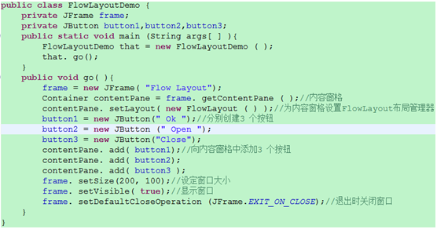
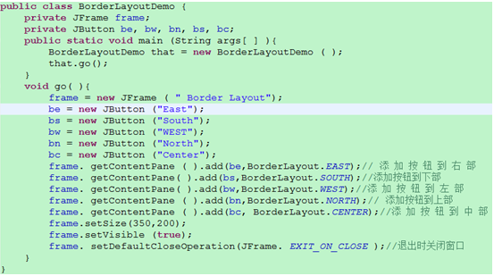
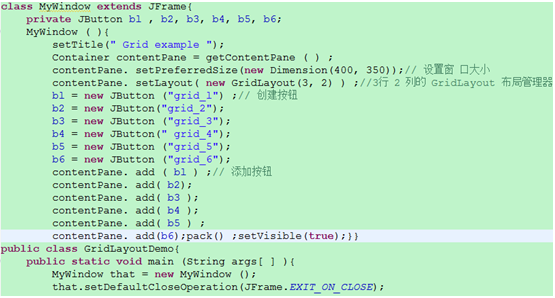
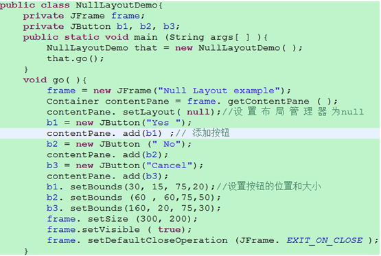
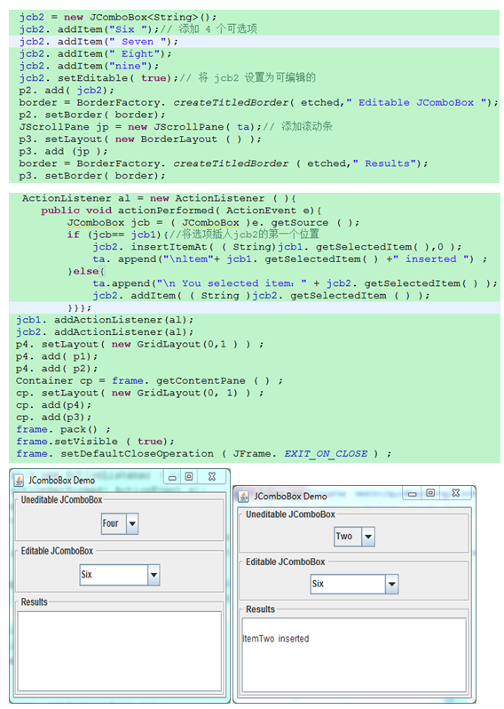
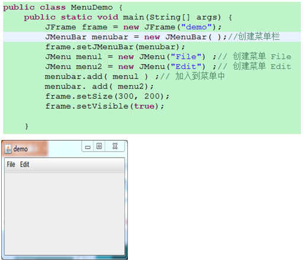
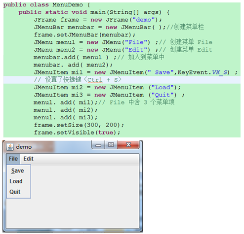
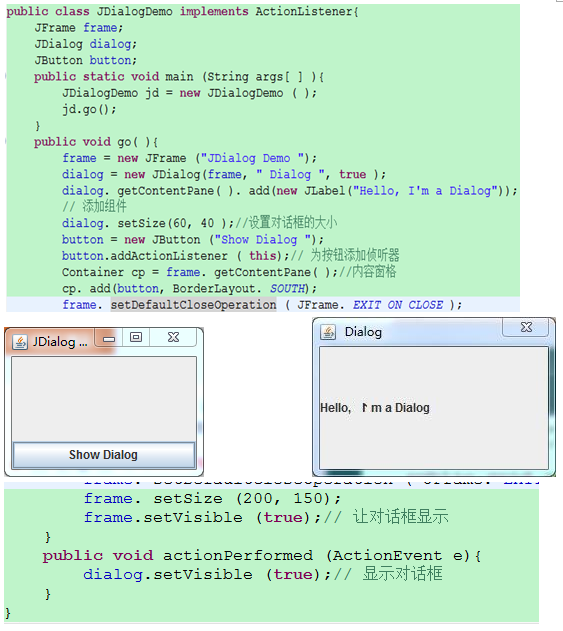
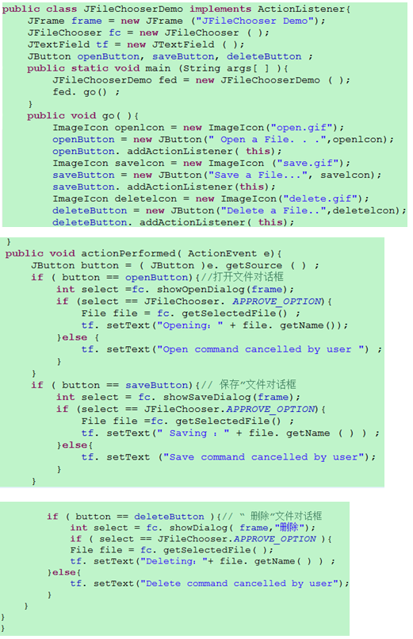

# 01 Java概述

**J2SE：标准版 **

J2EE：面向高性能企业计算的版本

J2ME：面向高性能移动计算的版本


#### Java特点

-   **语法简单、功能强大、安全可靠**
-   **与平台无关：写的java代码编译成与机器无关的二进制字节码，通过JVM虚拟机即时编译成机器码供计算机运行；**
-   **解释编译的两种运行方式：普通的编译成字节码和JIT即时编译成机器码**
-   **多线程**：同一时刻做多件事儿
-   **动态执行兼有丰富API文档和类库**


#### 有关的java程序

-   **javac.exe 编译器（重要）**
-   **java.exe  解释器（重要）**
-   jdb.exe  调试器
-   javap.exe  反编译器
-   javadoc.exe 文档生成器

源代码：.java    编译生成的二进制字节码：.class

**一个java文件只能包含一个公开的类，但是可以有多个私有类；java文件名和公开的类名必须一致；**

Java核心API共有43个包，每个包有若干个类、接口和属性；


#### 简要概述面向对象

面向对象方法学包括：**面向对象的分析（OOA）、面向对象的设计（OOA）和面向对象的程序设计（OO）**

面向对象的概念包括：抽象、对象、类、类型层次（之类）、**封装、继承、多态**等

对象具有：**状态和行为** 这两个特性；对象是类的实例！

OOP三大技术：封装、继承、多态；

面向对象的基本结构：类

>   java中不能使用指针
>
>   访问修饰符：private、protected、public、


# 02 数据和表达式

#### 注释

```java
// 单行

/* 
  多行
*/

/** 文档注释 */
```


#### 语句

**语句 是java程序的最小执行单位；**

语句间用 `分号；` 分开；

`大括号{ .... }` 内包含一系列语句，称为语句块；


#### 标识符

由字母、数字、下划线（_）或美元符（$）构成的字符串，数字不能作为标识符开头，区分大小写、长度无限制，不能含特殊符号（+、-、=、*、/及%等），也不能在标识符中有空白（换行符、回车符、空格、水平Tab键）;


#### **编程风格**

-   类、接口：每个单词首字母大写
-   方法名：首字母小写、其余单词首字母大写、尽量不要使用下划线；
-   常量：全部大写、单词间用下划线分开
-   变量：首字母小写，其余单词首字母根据情况大小写，尽量不要使用下划线


#### 数据类型

数据类型分：**基本数据类型** 和 **复合数据类型**

基本数据类型分：**整型(字节byte、短整型short、整型int、长整型long)、浮点型（单精度float、双精度double）、字符型(字符char)和布尔型(boolean)**

符合数据类型分：**类类型（class）、数组、接口类型（interface）**


-   0开头：八进制
-   0x开头：十六进制


integer.MAX_VALUE        int的最大值


char：16位、2字节、范围：0~65535

boolean：8位、1字节、java语言不允许数值和boolean之间的转换；


字符常量

-   `\???`    表示一个具体的Unicode字符，??? 是3位八进制数
-   `\u????`  表示一个具体的Unicode字符，????是4位十六进制数


表达式：由运算符和操作数组成，对操作数进行运算符指定的操作，并得到结果；

运算符包括：算数、关系、逻辑、位、赋值和条件运算符；

变量是存储数据的基本单元；

```java
int a = 2, b = 5, c;          // a和b：声明并赋值，简称初始化；     c：只声明
```


逻辑与和逻辑或提供 “短路” 操作功能；


变量作用域

...


数学函数   Math类

| Math.sin(0)      |      |
| :--------------- | ---- |
| Math.cos(0)      |      |
| Math.round(6.6)  |      |
| Math.sqrt(144)   |      |
| Math.pow(4, 2)   |      |
| Math.max(66,77)  |      |
| Math.min(22,100) |      |
| Math.random()    |      |


位运算（难点）

位运算主要用于对二进制位进行操作，包括：

取反：~

按位与：&

按位或：|

异或：^

右移：>>

左移：<<

无符号右移：>>>

无符号左移：<<<

位运算符只能对**整型**和**字符型**数据进行操作；


自动转换

能自动转换的类型：

byte short char int long float double

>   char -> int      自动


# 03 流程控制语句

####  语句、包

java程序由一条条语句组成、这些语句有：

-   **package：定义包，每个文件只能有一个，一定要放在文件最开始位置**
-   **import：导入包，可以导入一个或多个包**
-   public修饰的class类定义：每个文件最多一个，类名和文件名必须一致
-   class类定义：非public类可以有无数个
-   接口定义：每个文件包含的接口定义可有无数个

先有定义包，再导入其他包；

包的全称可以是 包名+类名 或 单单的包名；

```java
package com.mypackage;          // 先定义包，只能定义一次，此行是定义了当前类的包的包名为： com.mypackage 
import com.yourpackage.*;        // 导入com.yourpackage包下的所有类
import com.herpackage.*;          // 可以导入多个包

int main(){
    ...
}
```


#### 控制流程

**语句是java的最小执行单位**

语句分：**赋值语句**、**分支语句**和**循环语句**；

对应的语句流：**顺序流**、**分支流**和**循环流**；

##### 赋值语句

表达式可以是语句（表达式语句），但不是所有的语句都是表达式；

每个表达式都会得到一个值，即表达式计算结果；而语句也会得到一个返回值，但是这个返回值不往往不是计算结果，而是执行结果；


##### 分支语句

```java
if(表达式){         // if的表达式的结果必须是一个逻辑值（重点）
    if(表达式){
        // ...
    }else{
        // ...
    }
}
else if(表达式){
    //...
}
else{
    // ...
}
```

```java
switch(表达式){        // 这里：表达式的计算结果必须是：int型或char型（重点）
    case a:
        //...
        break;
    case b:
        //...
        break;
    case c: case d:
        //...
        break;
    [default:
        // ...
         break;
    ]
}
```


##### 循环语句

for、while、do...while

```java
for(int i = 0; i < 5; i++){
    System.out.println("hahahaha");
}

// 无限循环
for(;;){             // 这个相当于   for(;true;){
    //...
}
```

```java
int i = 0;
while(i < 3){         // while的表达式的结果必须是一个逻辑值（重点）
    System.out.println("hahahaha");
    i++;
}
```

```java
int i = 0;
do{
    System.out.println("hahahaha")
}while(i < 3);
    
// 与while的区别是：do...while语句至少需要执行一次
```


##### break和continue

break：跳出当前循环体，结束循环

continue：跳过当前在循环的那次


break

用于三类语句中：

-   switch语句
-   for、while、do...while语句中
-   语句块中

```java
for(int i = 0; i < 100; i++){
    if(i == 5) break;
    System.out.println("hahahaha");
}
```

```java
int x = 20;
out: for(i = 2; i < 10; i++){
    System.out.println("begin i = " + i);
    while(x < 100){
        System.out.println("i = " + i + " , x = " + x);
        if(i * x >= 80) break out;
        else x += 5;
    }
}
```

continue

```java
out: for(int i = 0; i < 10; i++){
	for(int j = 0; j < 20; j++){
        if(j > i){
            System.out.println();
            continue out;
        }
        System.out.print("*    ");
    }
}
```


#### 简单的输入/输出

Scanner类，属于包 `java.util`

```java
Scanner scan = new Scanner(System.in);
String msg = scan.nextLine();         // 从键盘读取一行数据
String msg2 = scan.next();       // 从键盘读取一条数据，碰到空白则算一条
double msg3 = scan.nextDouble();
int msg4 = scan.nextInt();
```


NumberFormat 和 DecimalFormat

```java
Double myNum = 12345.123456789;
Double test = 1.2345
NumberFormat.getInstance().format(myNum);        // 
NumberFormat.getCurrencyInstance().format(myNum);
NumberFormat.getNumberInstance().format(myNum);
NumberFormat.getPercentInstance().format(test);
```

```java
DecimalFormat


```


#### 异常

方法运行过程中，发生异常，称程序产生一个异常事件，相应的生成一个异常对象，该对象可能是正在运行的方法生成的，也可能是JVM生成的，将该异常对象传递给Java运行时系统，运行时系统会寻找相应的代码处理这一异常；

生成异常对象并将它提交给运行时系统这一过程称之为：抛出（Throw）异常；

**Exception是所有异常类的父类，Error类时所有错误类的父类，这两个类又同时是Throwable类的子类；**

异常分：**受检异常（必须被处理）**、**运行时异常（不需要处理）**和**错误（不需要处理）**

IOException：IO异常为受检异常，需要引入包：  `import java.io.IOException;`

```java
try{
    // ...可能发生的异常，异常后会抛出一个异常给运行时系统
}
catch(FileNoFoundException e){
    System.out.println(e.getMessage());
}
catch(IOException e){
    System.out.println(e.getMessage());
}
catch(Excetion e){
    System.out.println(e.getMessage());      // 输出异常信息
    System.exit(0);      // 中止程序运行
}
finally{
    System.out.println(“不管是否捕获到异常，都要执行这个finally语句...除非你在catch中执行：System.exit(0);”); 
}
```

受检异常包括：

-   ClassNotFoundException
-   FileNotFoundException
-   IOException
-   NoSuchMethodException
-   WriteAbortedException

运行时异常包括：

太多了...


公共异常：

-   ArithmeticException   除数为0时抛出此异常；
-   NullPointerException  空指针异常，即对象为null，想访问里面的方法或属性时会抛出此异常；
-   NegatuveArraySizeException 数组元素个数为负数时，异常；
-   ArrayIndexOutOfBoundsException 数组越界

抛出异常

即将捕获到的异常抛出到调用方法中：

```java
int main() throws ArithmeticException {         // 注意这里，Func抛出异常在这里捕获，注意throws是复数形式
    int i = Func(1, 0);
}
int Func(int a, int b){
    try{
        return a / b;
    }
    catch(ArithmeticException e){
        throw new ArithmeticException("除数不能为0啊");         // 向外抛出异常，注意throw是单数形式
    }
}
```


# 04 面向对象程序设计

## 类和对象

类含两部分：数据成员变量 和 成员方法

 访问修饰符：private、public和protected

-   private：只能被这个类本身访问
-   public：可以被其他任何对象访问
-   protected：受保护的，只可以被同一包及其子类的实例对象访问
-   默认没写的：可以被所在包中的各类访问

类可以指明父类，也可以不指明，当不指明时，默认派生自Object父类；即：Java语言中，除Object类外，所有类有且只有一个父类；

>   Object类是所有类的直接或间接父类。

## 构造函数

构造函数可以有多个，以重载来实现；

通过new来创建对象时自动调用对应的构造函数；

创建对象分配内存的这一过程叫做：实例化；

构造方法的作用是：创建类的实例的、为类内部的数据成员（即类的属性）初始化；

构造方法不能是：natie、abstract、synchronize、final类型，而应该是public类型；

构造方法不能从父类继承来；

构造方法没有返回值，也不能出现void关键字；

### 默认构造函数

每个类都必须有一个构造函数，我们没有指定的话，默认会自动生成一个方法体为空的无参构造函数；我们指定了一个或多个构造函数的话，默认的构造函数就不会自动创建；

### 构造方法重载

给定不同的参数或不同的类型参数，调用不同的构造方法；

实现的原理：重载

一个构造函数调用另一个构造函数的方式：this

```java
public class Student{
    String name;
    int age;
    public Studnet(string str, int a){
        name = str;
        age = a;
    }
    public Student(string str){
        this(str, 20);
    }
}
```

### this引用

this除了用在构造函数中，还能用来指明要操作的对象自身。

```java
public class Class{
    private int age;
    public void showAge(){
        System.out.println("hello,i'm " + this.age);
    }
}
```

 因为age就在该类本身，即this可以省略

### 对象的创建和初始化

可以认为：类就是“模板”，一个个的对象可以认为是从这个“模板”刻出来的“物品”；

new关键字：向内存申请内存空间

Date myBirthday = new Date();    将申请到的内存空间的首地址赋给myBirthday对象的引用；

使用**构造方法**是生成实例对象的唯一途径，这个过程称为对象的：实例化；

初始化对象时，如果没有为类成员初始化，则系统会默认为这些成员变量提供初始值，即：自动初始化；

 ```java
Date today;        // today在内存中没有存放值
today = new Date();      // 实例化后，内存分配了Date实例的地址，初始化了成员变量，同时将这个实例的首地址存放到引用today内；
 ```

值类型：对一个变量的修改不会影响到另一个类

```java
int a = 4;
int b = a;
b = 5;
System.out.println(a);         // 输出 4
```

引用类型：只存在一个String对象，类型为String的变量s和s1都指向这个对象；对任何一个变量的修改，修改的都是这个对象，也都会影响到另一个变量：

```java
String s = "Hello";
String s1 = s;
s = "World";
System.out.println(s1);    // 输出 Hello     这个我也不知道，可能是新版Java改了
```

>   java中，null表示引用不指向任何对象；

## 定义方法

### 方法的定义

### 按值传递

传给方法的值称为**实参**，方法的参数列表中列出的值称为**形参**；

按值传递：即将值传递给方法；

按引用传递：传递给方法的是内存地址，即实参指向的对象的首地址；

### 方法重载

重载：规定方法的参数列表必须不完全相同；

不完全相同：参数的个数、各参数的类型，他们之间的顺序

方法签名：**方法名称**加上**方法参数列表**（包括方法的**参数个数**、**顺序**和**类型**）称为方法签名；

即：方法重载的条件是：方法签名一定不能相等；

>   注意：方法签名的不包括返回值或返回值类型

## 静态成员

类中的特殊成员：静态成员/类成员；用 static 关键字修饰普通成员即可；

静态成员包括：静态变量 和 静态方法

静态成员不依赖该类的对象；

通过new向内存申请内存空间来创建的每个类对象实例都是不同的内存空间的，也就是每个对象内的成员互相独立，即内存地址不一样；而类中的静态成员是在类定义时就分配内存了，这时还没有创建对象，也没有对类进行实例化；以后再传你就按该类的时候就不会再为静态成员分配内存了；

总结：静态成员是一块独立的内存，不受创建对象的影响，在类定义时就已经完成了静态成员的初始化（内存空间分配）；同一个类对应的每个对象都可以共享访问其该类中的静态成员；

静态变量是唯一为类中所有对象共享的变量；

如果一个静态变量同时还被定义为public类型，那么其他类也同样可以使用这一变量，且只需要通过类点的方式访问而不需要通过创建类对象来访问；

静态方法不能被重写；

**因为静态方法可以被类外部访问，所以静态方法内不存在this，即静态方法只能使用其静态方法内部定义的参数或外部的静态变量，如果使用外部非静态变量将引起编译错误；**

```java
public class Test {
	private String a;
    private static String sStatic;
	public static void StaticFunc() {
		int bint = 7878;
		this.a = "666";       // 这里编译错误，因为静态方法内不能有this
        a = "787878";      // 这里编译也错误，因为静态方法内不能使用静态方法外的非静态成员，而只能使用静态方法外的静态成员
        sStatic = "787878";      // 正确
		System.out.println(bint);
	}
}
```

## 包装类

用处理对象一样的方式来处理基本类型的数据时，必须将基本类型值“包装”为一个对象，为此Java提供了包装类；

包装类表示一种特殊的基本类型。例如：Integer整型类，该包装类的构造方法接受一个基本类型的值，并将它保存；

`Integer ageObj = new Integer(40);`

除了Integer、Java中的每一个基本数据类型都有其对应的包装类；都定义在`java.lang`中

有如：Byte、Short、Integer、Long、Float、Double、Character、Boolean、Void等；

包装类都提供了：返回存储在对象内的值的方法 和 对对象内保存的值进行类型转换为其他基本数据类型的方法；

```java
var intObj = new Integer(40);
int i = intObj.intValue();      // i 为 40
int result = Integer.parseInt("41");   // result 为 41
System.out.println(Integer.MAX_VALUE);  // 输出 int的最大值
```

>   自动装箱：自动将基本类型转为对应的包装类；
>
>   自动拆箱：与自动装箱相反，自动将对应的包装类转为基本类型；
>
>   自动装箱与自动拆箱仅能用在基本数据类型与对应的包装类之间，将基本数据类型赋值给对象的引用变量，或是相反的过程，都会导致编译过程的错误！


练习出现的问题：

**什么是实例方法？**

实例方法是相对于静态方法而言的，没有static静态前缀的一般方法，被对象拥有；

静态方法可以调用实例成员，和实例方法不可以调用静态成员，可以参考下面代码：

```java
public class Test{
    static int a;
    int b;
    public static void main(String[] args){
        System.out.println(a);         // 静态方法可以调用静态成员a
        System.out.println(b);         // 异常，静态方法不可以调用非静态成员b
        InvokeStatic();                // 异常，静态方法不能调用非静态方法
        Class2 c = new Class2();
        c.InvokeStatic();
    }
    public void InvokeStatic(){}
}
class Class2{
	static int a;
	int b;
	public void InvokeStatic() {
		System.out.println(a);         // 实例方法可以调用静态成员a
        System.out.println(b);         // 实例方法可以调用非静态成员b
	}
}
```

在实例方法内：实例方法和静态方法都能调用；

在静态方法内：只能调用静态成员，不能调用非静态成员；

静态成员默认是共有public的，但你也可以设置为私有private的，一般设置共有的被外界能访问到的；


# 05 数组和字符串

概念：一个数组是相同数据类型的元素，按一定顺序排列的集合；

通过数组下标访问数组中的每一个元素；下标从0开始；

在Java中，数组是对象；

数组元素的类型是可以是基本类型、类类型、接口类型，还可以是数组；

## 数组声明

数组使用前必须先声明，也就是需要先定义后使用；

一维数组：

`类型 数组名[]`

```java
char s[];
int b[];
Date c[];
Point d[];
// Java中还提供另一种数组的声明，和上面的都是等价的：
char[] s;
int[] b;
Date[] c;
Point[] d;
```

上面的数组定义，并不会为数组分配内存，因此方括号中不需要指定数组元素的个数，即不需要指定数组的长度；

上的声明的数组名只是引用变量，用来指向一个数组；

## 创建数组

数组声明仅仅是定义了一个数组的引用，系统并没有为数组分配任何内存，因此现在还不能访问他的任何元素，必须经过数组初始化后才能使用数组的元素，初始化的过程就是数组的创建过程；

数组的初始化分：静态初始化和动态初始化；

-   静态初始化：使用一对大括号将初值括起来，每个元素对应一个引用；
-   动态初始化：在定义数组的同时，给数组元素赋初值；

```java
// 静态初始化：
int intArray[] = {1, 2, 3, 4, 5};               // 警告：这里的[]不能放入数组长度，即 int intArray[5] 是错误的
boolean[] hired = {true, false, true, true};
String names[] = {"Hi", "Hello", "!"};

// 上面的静态初始化String等价于下面的动态初始化：
String[] names = new String[3];
names[0] = "Hi";
names[1] = "Hello";
names[2] = "!";
```

## 访问数组元素

数组下标从0开始，数组元素中的个数length是数组类中唯一的数据成员变量，使用new创建数组时系统自动给length赋值；

```java
int list[] new int[10];
for(int i = 0; i < list.length; i++){
    System.out.println(list[i] + "\t");
}
```

数组的下标访问时： 0~length-1，下标可以是**整型常量**或**表达式**；    这里不要把整型参数说成整数

## 多维数组

### 多维数组的定义

-   `int 二维数组名[][]`
-   `int[][] 二维数组名`
-   `int[] 二维数组名[]`

多维数组的特点和一维数组一样，这里不做多讲述；

### 多维数组初始化

静态初始化数组：

`int intArray[][]  = {{2, 3}, {4, 5}, {7, 8}};`

和一维数组一样，这里不必指出数组每一维的大小，系统会根据初始化时给出的初值的个数，自动计算数组每一维的大小，即每一维的数组长度；

静态初始化数组的调用：`intArray[1][1]`   的结果为：5

动态初始化数组：

分两种方式分配内存空间：直接分配 和 按维分配

直接分配：直接为每一维分配空间，声明数组时，给出各维的大小；

`int a[][]  = new int[2][3];`       声明了一个2行3列的二维数组

按维分配：从最高位起（必须从最高维开始），分别为每一维分配内存；

```java
int a[][] = new int[4][];
a[0] = new int[5];
a[1] = new int[5];
a[2] = new int[5];
a[3] = new int[5];
// 因为这里的二维大小一样，所以这是一个矩阵数组；
```

二维的数组长度也可以不一样，这样出来的数组就试非矩阵数组；

>   数组长度的指定只能出现在new运算符之后
>
>   错误：`int a[][4] = new int[3][4];`
>
>   通过new方式，右边必须至少设置第一维数组的长度；
>
>   错误：`int[]a[] = new int[][];`

### 多维数组的引用

`数组名[第一维数组下标][第二维数组下标]`

注意：二维数组也有length属性，但它只表示第一维数组的长度；

```java
int[][] ages= new int[4][7];
int[]firstArray = ages[0];
System.out.println(ages.length + " - " + firstArray.length);      // 4 - 7
```

```java
int ag[][] = new int[4][7];
System.out.println(ag.length);        // 4
```

数组是用来表示一组同类型数据的数据结构，并且数组是定长的，初始化后数组的大小不会在动态变化，数组变量是一个指向数组对象实例的引用；

数组创建后就不会再改变它的大小，但是可以使用同一个引用变量指向另一个全新的数组：

```java
int a[] = new int[6];
a = new int[8];
```

除了上面的复制数组方法，System类中提供了一个特殊的方法arraycopy()用来高效的对数组进行复制；

```java
int a[] = {1, 2, 3, 4, 5, 6};
int b[] = {7, 8, 9, 10, 11, 12, 13, 14, 15, 16};
System.arraycopy(a, 1, b, 2, 4);    // 将a中从下标1开始的4个元素，一次放到b中下标从2开始的相应位置
System.out.println(b);     // 7 8 2 3 4 5 13 14 15 16 
```

>   数组a和b作为方法arraycopy的参数使用，当数组作为函数参数时，是将数组引用传给方法，方法中对数组内容的任何改变都将对方法外有影响；

`java.util.Arrays` 为数组提供了一些列静态方法：

-   equals(type[], type[])： 判断type类型的两个数组的值是否相等，type可以是基本数据类型，也可以是引用类型；
-   sort(type[])：将type按升序排序数组元素，如果type为对象，则调用对象的compareTo()来比较结果；
-   file(type[], type value)：将type类型的值赋给type类型数组的每个元素；
-   binarySearch(type[], type value)：采用二分查找法在type类型的数组中查找type类型的值value；

## 字符串

字符串是由有线字符组成的序列；

Java中的字符串是一个对象，而不是以"\0"零结尾的字符数组，这和C和C++不同；

Java的标准包`java.lnag`装封装了String 和 StringBuffer 类，用于处理字符串。String处理不变字符串，StringBuffer处理可变字符串；

字符串是内存中连续排列的0个或多个字符；

不变字符串是指字符串一旦创建，其内容就不能改变，如对String类的实例进行查找、比较、连接等操作时，既不能输入新字符，又不能改变字符串的长度。

Java中，字符串分为常量字符串和变量字符串；

**常量字符串**

`System.out.println("Hello,World");`        // 系统会为常用字符串自动创建一个String对象

**变量字符串**

声明字符串：

`String a;`

`StringBuffer b;`

创建空白字符串：

`String a = new String();`

`StringBuffer b = nwe StringBuffer();`

由字符数组创建字符串：

```java
char chars[] = {'a', 'd', 'q'};
String s = new String(chars);
```

由字符串常量创建字符串：

`String a = "Hello";`

StringBuffer 不能使用字符串常量创建；

当可以通过String来创建StringBuffer字符串：

```java
String a = "Hello";
StringBuffer b = new StringBuffer(a);
```

## 字符串操作

String类的对象实例是不可改变的，一旦创建就确定下来。对字符串施加操作后并不改变字符串本身，而是又生成了另一个实例；StringBuffer类处理可变字符串，当修改一个StringBuffer类的字符串时，不是再创建一个新的字符串对象，而是直接操作原字符串；

他们两个类都提供了：

-   length()
-   charAt(int index)
-   subString(int beginIndex)

String类有如下常用方法：

-   replace(char oldChar, char newChar)
-   toLowerCase()
-   toUpperCase()
-   concat(String str)
-   startsWith(String prefix)
-   trim()
-   valueOf(type value)
-   append(String str)
-   replace(int start, int end, String str)
-   capacity()

StringBuffer类有如下常用方法：

-   append(String str)
-   replace(int start, int end, String str)
-   capacity()

>   需要熟记上面每个函数的意思和用法，考试会考的哦

系统为String类对象分配内存时，按照对象中所含字符的实际个数等量分配，而为StringBuffer类对象分配内存时，除去字符所占空间外，在另加16个字符大小的缓冲区，对于StringBuffer类对象，length()方法获得的是字符串的长度，capacity()方法返回当前容量，即字符串长度再加上缓冲区的大小！

>   补充：String类不能被继承，因为其被final的修饰符修饰，被final修饰的类不能被继承的；

对字符串的比较：compareTo()、equals()、equalsIgnoreCase()、regionMatches()等

String类可以用 `+` 号将两个字符串串联，用 `==` 判断两个字符串知否相等，与equals()不同，`==` 判断两个字符串对象是否同一实例，即他们在内存空间中的存储空间是否相同；9

```java
String s1 = "ABC";
String s2 = "ABC";
String s3 = new String("ABC");
String s4 = new String(s1);
String s5 = s1;

System.out.println(s1.equals(s2));          // true
System.out.println(s1 == s2);               // true
System.out.println(s1.equals(s3));          // true
System.out.println(s1 == s3);               // false
System.out.println(s1.equals(s4));          // true
System.out.println(s1 == s4);               // false
System.out.println(s1.equals(s5));          // true
System.out.println(s1 == s5);               // true
```

>   上述代码中，通过new创建的对象是另一个实例的了， == 号判断的结果必然是false

## Vector 向量类

因为Java中的数组只能保存固定数目的元素，数组空间一经申请就不可再改变，不能再追加数组的空间。Vector向量类就是解决这一问题的，可以看做是可变数组；

Vector在 `java.util`包中，是比数组更强大更重要的工具类，可使用下标访问每个元素；

创建Vector类对象后，可以增加和删除其中元素，相应的大小也会随之改变；

每个元素类型可以不一样，即可以吧Vector看作是把不同类型的元素按照**动态数组**进行处理

但是：**向量只能保存对象类型的元素，不能保存基本类型的元素；**

向量类中的常量成员：

-   protected intcapacityIncrement：增量大小，为0，则缓冲区的大小每次增倍。
-   protected intelementCount：Vector向量对象中元素的数量
-   protected ObjectelementData[]：元素存储的数组缓冲区

系统内部会记录Vector类实例的容量capacity，实际保存的元素个数由elementCount来记录，这个值不能大于容量值，当有元素加入到向量时，elementCount会相应增大。当向量中添加的元素超过了它的容量后，向量的存储空间以容量增值capacityIncrement的大小为单位增长，为以后新的元素加入做好准备，元素保存在数组elementData中。

### Vector类的方法

#### 构造方法

-   public Vector();
-   public Vector(intinitialCapacity)：以指定的初始存储容量intinitialCapacity构造一个空的向量Vector
-   public Vector(intinitialCapacity, int capacityIncrement)：以指定的初始存储容量intinitialCapacity和容量增量capacityIncrement构造一个空的向量Vector；

`Vector<String> MyVector = new Vector<String>(100, 50);`

这代码表示：创建MyVector向量序列初始有100个字符串的空间，以后一旦空间用尽则以50位单位递增，即可能是150, 200....

#### 向Vector添加元素

```java
Vector<Double> myVector = new Vector<Double>();
for(int i = 0; i < 10; i++){
    Double j = Math.random();
    myVector.addElement(j);
    System.out.println(i + " - " + j + '\t');
}
System.out.println(myVector.elementAt(5) + "\t");
--------------
myVector.insertElementAt(5555d, 5);   // 向下标为 5 的位置插入 5555d，原第5条往后移
System.out.println(myVector.elementAt(5) + "\t");
System.out.println(myVector.elementAt(6) + "\t");
--------------
myVector.add(5, 6666d);   // 向下标为 5 的位置插入 6666d，原第5条往后移
System.out.println(myVector.elementAt(5) + "\t");
System.out.println(myVector.elementAt(6) + "\t");
--------------
myVector.addElement(6666d);  // 在myVector末尾追加 6666d 元素
```

#### 元素的修改或删除的方法

```java
Vector<Double> myVector = new Vector<Double>();
for(int i = 0; i < 10; i++){
    Double j = Math.random();
    myVector.addElement(j);
    System.out.println(i + " - " + j + '\t');
}
System.out.println(myVector.elementAt(5) + "\t");
// --------------
myVector.setElementAt(6666d, 5);    // 覆盖下标为5的元素的值，即修改
System.out.println(myVector.elementAt(5) + "\t");
System.out.println(myVector.elementAt(6) + "\t");
// --------------
myVector.removeElement(myVector.elementAt(5));    // 删除内容为5的元素，即删除
myVector.removeElementAt(5);    // 删除下标为5的元素，即删除
System.out.println(myVector.elementAt(5) + "\t");
System.out.println(myVector.elementAt(6) + "\t");
// --------------
myVector.removeAllElements();      // 删除所有元素，大小重置为 0
System.out.println(myVector.size()+ "\t");           // 0
```

#### 元素的查找方法

```java
Vector<Double> myVector = new Vector<Double>();
for(int i = 0; i < 10; i++){
    Double j = Double.valueOf(i);
    myVector.addElement(j);
    System.out.println(i + " - " + j + '\t');
}
System.out.println(String.valueOf(myVector.elementAt(5)));   // 超出界限会 ArrayIndexOutOfBoundsException异常
System.out.println(myVector.contains(9.0));           // true
System.out.println(myVector.indexOf(4.0, 0));         // 4
System.out.println(myVector.indexOf(10.0, 0));          // -1
System.out.println(myVector.lastIndexOf(8.0, myVector.size()-1));         // 8    ???疑问???
```

>   不通过new方式创建Vector对象，直接使用其里面的方法的话，会造成堆栈溢出或使用null指针异常等；


这题挺有意思的：

```java
// 课本113页第7题
String[] aString = new String[5];
for(int i = 0 ; i < 5;) {
    aString[i++] = "";          // 主要是这里
}
for(int i = 0 ; i < aString.length; i++) {
    System.out.println(aString[i]);
}
```


# 06 继承与多态

## 子类

继承这一面向对象的特性，可以支持软件的可复用性，保证了代码可以在类之间共享；

### is a 关系

经理 is a  雇员

整体与部分关系：has a  如：汽车与发动机、车身；

### extends关键字

父类：基类、超类

子类：派生类

共有的成员放在父类，特有的成员放在各自的子类中；

`public class A extends B`        A类派生于B类

>如果一个类没有extends，则默认该类会派生于Object类；
>
>Java中预定义类或程序员自定义的任何类，都直接或间接继承于Object类；
>
>Object类是所有类的父类或祖先类；

### Object类

Object类是所有类的父类或祖先类，所有的类都是从Object类派生来的；

成员函数：

-   public final Class getClass();       返回当前对象所属的类信息，返回Class对象
-   public String toString();               按字符串对象方式返回当前对象本身的有关信息
-   public boolean equals(Object obj);         比较两个对象是否是同一个对象，是则返回true

对象的判断：== 和 equals() ；  

两个对象是否是同一个对象，称为：同一；

具有相同的类型及相同的属性值，称为：相等；

同一的对象一定相等，相等的对象不一定同一；

== 和 equals 判断的都是 同一，即两个对象是否是同一对象，一般的，通过new创建的两个对象不同一，通过对象赋值给另一个对象的为 同一；

### 单重继承

多重继承：一个类可以有多个父类；相当于：一个儿子有多个父亲；

单重继承：一个类只有一个父类；相当于：一个儿子只有一个父亲；

Java是：单重继承；

Java的“多重继承”的能力通过 接口类 来实现；

子类不能继承父类的：构造方法（但可以通过super调用父类的构造方法）、静态方法（没必要）、私有成员；（但可以继承受保护的、共有的成员）

### 对象转型

即：将之类的对象赋值给父类的对象，这叫做对象转型；

`Father f = new Son();`

类的变量既可以指向本类实例，又可以指向其子类的实例，这表现为对象的多态性；

如果需要判断一个引用到底指向哪一个实例。那么可以通过运算符 instanceof 来实现；

```java
// A 继承 B ，C也继承B，a、b和c分别是A、B和C的对象：
a instanceof B;           // true
a instanceof C;           // true
b instanceof A;           // false
```

```java
class B{}

public class A extends B {
	public static void main(String[] args) {
		B b = new A();
		System.out.println(b instanceof A);       // true
	}
}
```

## 方法覆盖与多态

父类中原有的方法可能不能满足新的要求，因此需要修改父类中已有的方法，这就是方法覆盖，也称方法重写或隐藏。

子类中定义方法所用的名字、返回类型及参数列表和父类中方法所使用要完全一样，也就是具有相同的方法签名，此时称子类方法覆盖（重写）了父类中的方法，从逻辑上看就是子类中的成员方法将隐藏父类中的同名方法；

### 方法覆盖及其规则

注意：如果方法名相同而参数列表（方法签名）不同，则这种情况是对方法的重载，而不是方法覆盖；

父类方法被子类覆盖，如果还想子类使用父类隐藏的方法，则需要 super关键字：

```java
public class A {
	protected void show() {
		System.out.println("A");
	}
}


class B extends A {	
	public void show() {
		System.out.println("B");
		super.show();          // 调用父类的show函数
	}
}

class C{
	public static void main(String[] args) {
		B b = new B();
		b.show();      // 调用的是被B类覆盖的show
	}
}

// 输出：    B     A
```

super关键字可以调用父类共有成员，其实如果在父类找不到，会继续往上找父类的父类、直到找到Object类才停止；

覆盖时需要注意：源于多态性和Java具有的“类型安全”的要求：

-   覆盖方法的允许访问范围不能小于原方法
-   覆盖方法所抛出的异常不能比原方法更多

### 调用父类的构造方法

super关键字可以调用父类共有成员，其实如果在父类找不到，会继续往上找父类的父类、直到找到Object类才停止；

super关键字可以在子类构造函数中调用父类的构造函数；如果子类没有明确调用父类构造函数，则系统会再子类中自动调用父类的默认构造函数；

如果在子类构造方法的定义中调用了父类的构造方法，则调用语句必须出现在子类构造方法的第1行：

```java
public class A{}
public class B extends A{
    public B(){
        super();          // 放在第一行正确
        // do something...
        // super();        // 放这里是错误的
    }
}
```

### 多态（重点，牢记）

A继承B，A中的func方法重写父类B中的func方法，则： `B ab = new A();  ab.func()` 调用的是父类的func方法还是子类的func方法？          子类

分析如下：

概念：重载一个方法名可以看作是多态，父子类之间直接或间接重写的方法名要由对象在**运行时**确定将调用哪个方法，这也是多态；

Java规定，要执行的是与对象真正类型（运行时类型）相关的方法，而不是引用类型（编译时类型）相关的方法；

-   编译时：变量的静态类型是出现在声明中的类型，例如，变量ab的静态类型是B，静态类型也称为引用类型，是在代码编译时确定下来的；
-   运行时：运行过程中，某一时刻变量指向的对象的类型称为动态类型，这是他此刻的真正类型，变量的动态类型会随运行进程而改变，ab的动态类型是A


-   动态绑定：调用稍后可能被覆盖的方法的这种处理方式，成为动态绑定或后绑定，动态绑定一定要到运行时才能确定要执行的方法代码；
-   静态绑定：在编译过程中能确定调用方法的处理方式，称为静态绑定或前绑定；

## 终极类 final 与抽象类 abstract

final关键字，终极、修饰一个类或成员。表示被修饰的类或成员不能改变；

-   如果类被修饰为final终极后，称为终极类，其不能有子类；
-   如果方法被修饰为final后，该方法也不能被子类重写/覆盖；
-   如果变量被修饰为final后，该变量的值就不能改变；

与之相反的是 abstract 关键字；用于类或方法，称为抽象，被 abstract 修饰的方法的只能为空，类必须被子类继承或子类实现；

### 终极类

String类被final修饰，即：String类不能有子类，不能被继承；这称为终极类、终态类；

`final class A(){}`

### 终极方法

被final修饰的方法称为：终极方法、终态方法；

被final标记的方法不能被子类重写/覆盖；

被final标记的也被用于优化，提高编译运行效率；

`final String Func(){}`

### 终极变量

被final修饰的变量称为：终极变量或终态变量；不能被修改，它会称为常量；

如果将一个引用类型的变量标记为final，那么这个变量将不能再指向其他对象，但他所指对象中的属性值还是可以改变的，如下代码：

```java
class A{
    int num = 123;
}
class B{
    public static void main(String[] args){
        final A a = new A();
        a.num = 456;       // 正确
        a = new Car();     // 错误
    }
}
```

## 抽象类

概念很好理解：课本129页

在类中定义了方法，但没有定义具体实现（没有方法体）的类称为抽象类，抽象类也可以有具体常规的类成员（有实现的成员）；

```java
// 抽象类，不能被new实例化创建对象
public abstract class D{           // 抽象类还是类，需要关键字 class
	public void func() {             // func：普通方法，非抽象方法
		System.out.println("hello");	
    }
    
    // 只有方法声明的抽象方法（即：没有方法体）
	public abstract String getName();       // 抽象方法，没有具体的方法体，实现该方法需要在子类中以重写的方式实现;	}
}

public class E extends D{         // 子类E 继承 抽象类D, 子类能被实例化
    public String getName(){       // 子类必须重写父类的全部抽象方法，这样E类才能是非抽象类
        return "Zhangsan";
    }
}
```

抽象类因为有没有实现的方法、所以抽象类不能被new实例化；必须生成抽象类的一个非抽象的子类后才能创建实例；

抽象类也可以包含构造方法；

抽象类中通常会包含抽象方法，这种方法只有方法的声明，而没有方法的实现，这些方法将在抽象类的子类中被实现；

只有抽象类才具有抽象方法，普通类中不能定义抽象方法；包含抽象方法的类一定时抽象类，抽象类不一定都有抽象方法（因为还有其他成员方法）；

## 接口

接口是体现抽象类功能的另一种方式，可以将其想象为一个“纯”的抽象类，即内部的成员全都不能有具体的实现；

接口是特殊的抽象类；

Java不能继承多个类和多个抽象类，但是可以继承多个接口；

### 接口定义

关键字：interface

在接口中定义的成员变量都默认为终极静态变量，即：系统会将其自动添加 final 和 static 两个关键字，并且对该变量必须设置初值；

```java
interface A{         // 接口不是类，没有class关键字，注意这点
    String aString = "123";       // 成员变量必须声明并赋初值，可以没有public、final和static关键字
    void put(char c);
    char get();
}
```

### 接口实现

关键字：implements

一个类可以实现多个接口，并且该类或该类的子类必须实现接口中的所有“抽象方法”；

```java
interface A{         // 接口不是类，没有class关键字，注意这点
    void put(char c);
    char get();
}

public class B implements A{
    private char mem[] = new char[10];
    private int point = 0;
    public void put(char c){
        mem[point] = c;
        point++;
    }
    public char get(){
        point--;
        return mem[point];
    }
}
```

>   Java规定：**接口和接口内的抽象成员必须是public，所以接口类和接口内的抽象成员可以省略public关键字、除此之外还可以省略 final 和 static 关键字；**

>   接口和抽象类都不能实例化（因为有未实现的抽象成员）

同抽象类一样，使用接口名作为一个引用变量的类型也是允许的，即：可以声明接口类型的变量（或数组），并用它来访问对象，该引用可以用来指向任何实现了该接口的类的实例，使用时将根据动态绑定的原则，视该变量所指向的具体实例来进行操作。

这么多字，看下面代码即可：

```java
interface IA{
    void show();
}
class B implements IA{
    public void show(){
        System.out.println("Hi~");
    }
}
void main(String[] args){
    IA iab = new B();
    iab.show();
}
```


本章练习 心得：

单选第一题：

```java
public class A {
	protected void show() {
		System.out.println("A");
	}
}


class B extends A {	
	public void show() {
		System.out.println("B");
		super.show();
	}
}

public static void main(String[] args) {
    A a = new A();
    B b = new B();
    a = b;
    // 上面的写法其实和下面的写法一模一样；
    A a = new B();
}

```

接口中不存在构造方法的；

抽象类虽然不能实例化，当可以有抽象方法（要实现），用于给子类super调用；


# 07 输入与输出(需要重新梳理)

## 数据流的基本概念

把不同类型的输入输出源抽象为流；其中输入或输出的数据成为数据流，用统一的接口来表示

数据流是指一组有序的有起点和终点的字节集合；

数据流分为输入数据流和输出数据流，输入数据流只能读不能写，而输出数据流只能写不能读，必须有一个数据源与该数据流相连；

java.io 包提供了表示数据流的4个基本的抽象类：`InputStream`、`OutputStream`、`Reader`、`Writer`。

引入包：`import java.io.*`

处理字节流：InputStream、OutputStream；处理字符流：Reader、Writer

为了使对象的状态能够方便的永久保存下来，java.io 包中又提供了以字节流为基础的用于对象的永久化保存状态的机制，通过实现 `ObjectInput` 和 `ObjectOutput` 接口来完成；

处理对象（序列化对象）：ObjectInput、ObjectOutput

### 输入数据流

**输入数据流** 是指 **只能读不能写** 的数据流；比如从键盘输入的数据中；

java.io包中的所有输入数据流都是从抽象类 InputStream 继承来的，并实现了其中各自的方法；包括：读取数据、标记位置、重置读写指针、获取数据量等；

输入数据流提供的方法：

-   int read();    // 从输入流中读取一个字节的二进制数据
-   int read(byte[] b);     // 将多个字节读到数组中，填满整个数组
-   int read(byte[] b, int off, int len);       // 从输入流中读取长度len的数据，从数组b中下标为off的位置开始放置读入的数据，读取完毕后返回读取的字节数；

上面这三个方法读取的类型都是 **字节类型**，返回-1表示读取完毕；

-   void close();         // 关闭数据流
-   int available();       // 返回目前可以从数据流中读取的字节数(但实际的读操作所读的字节数可能大于该返回值）
-   long skip(long l)；       // 跳过数据流中指定数量的字节不读取，返回值表示实际跳过的字节数。

>   回推
>
>   对数据流中字节的读取通常是按 **从头到尾** 顺序进行的，如果需要从反方向读取，则需要使用 **回推** 操作，在支持回推操作的数据流中经常用到如下几个方法：
>
>   boolean markSupported();        // 用于测试数据流是否支持回推操作，当数据流支持mark()和reset()方法时返回true，否则返回false;
>
>   void mark(int markarea);          // 用于标记数据流的当前位置并画出一个缓冲区，其大小至少为指定参数的大小
>
>   void reset();             // 将数据流重新定位到此流最后调用mark方法时的位置

### 输出数据流

**输出数据流 **是指 **只能写不能读** 的流，用于从计算机中输出数据；

-   java.io 包中大多数输出数据流都是由抽象类 OutputStream 继承来的；支持的方法有：
-   void write(int i);         // 将字节i写入到数据流中，它只输出所读入参数的最低8位。该方法是抽象方法，需要在其输出流子类中加以实现，然后才能使用；
-   viod write(byte b[]);        // 将数组b[]中的全部b.length个字节写入数据流。
-   void write(byte b[], int off, int len);        // 将数组b[]中从下标为off开始的len个字节写入数据流。元素b[off]是此操作写入的第1个字节，b[off+len-1]是此操作写入的最后一个字节;

上面的方法，在实际应用过程中，通常以系统允许的最大数据块长度为单位进行写操作；

-   void close();        // 当结束对输出数据流的操作时，应该将其关闭
-   void flush();        // 刷新此输出流并强制写出所有缓冲的输出字节

>   flush存在的意义
>
>   在目前通用的存储介质中内存访问的速度是最快的，因此，为加快数据传输速度，提高数据输出效率，有时输出数据流会在提交数据之前把所要输出的数据先暂时保存在内存缓冲区中，然后成批进行输出，每次传输过程都以某特定数据长度为单位进行传输，在这种方式下，数据的末尾一般都会有一部分数据，由于数量不够一个批次，而存留在缓冲区里，调用方法flush()可以将这部分数据强制提交；

## 基本字节数据流类

InputStream和OutputStream两个类都是抽象类，抽象类是不能进行实例化的，因此在实际应用中经常用到的并不是这两个类，而是一系列基本数据流类，他们都是InputStream和OutputStream的子类，在实现其父类方法的同时，又都指定了其特有的功能；

### 文件数据流

进行文件 I/O 处理的类：FileInputStream 和 FileOutputStream；处理的对象为文件（数据源）；不支持mark()和reset()方法（即：回推）；

`FileInputStream fis = new FileInputStream("文件路径");`

`FileOutputStream fis = new FileOutputStream("文件路径");`

如对FileInputStream所制定的文件路径不存在，则报 `FileNotFoundException`异常，需要对其捕获

如对FileOutputStream所制定的文件路径不存在，则会再该路径创建一个文件；存在，则写入时，则会覆盖旧文件；

读写过程的其他错误，会报 `IOException` 异常；

```cpp
import java.io.*;

public class A{
	public static void main(String[] args) throws FileNotFoundException {
		FileOutputStream fopStream = new FileOutputStream("a.data");
		try {
			fopStream.write('H');
			fopStream.write(65);
			fopStream.write(97);
			fopStream.flush();
			fopStream.close();			
			
			FileInputStream fis = new FileInputStream("a.data");
			while(fis.available() > 0)
				System.out.println(fis.read());
			
			fis.close();
		}
		catch (FileNotFoundException fnot) {
			System.out.println("文件找不到...   " + fnot.getMessage());
		}
		catch (IOException e) {
			System.out.println("文件操作异常    " + e.getMessage());
		}		
	}	
}
```

### 过滤器数据流

特殊的数据流：过滤器数据流；

一个过滤器数据流在创建时与一个已经存在的数据流相连，这样在从这样的数据流中读取数据时，他提供的是对一个原始输入数据流的内容进行了特定处理的数据；

#### 缓冲区数据流

缓冲区数据流：BufferedInputStream 和 BufferedOutputStream

他们两个都是在数据流上增加了一个缓冲区，其都属于过滤器数据流;

当读写数据时，数据以块为单位先进行缓冲区（块的大小可以进行设置），其后的读写操作则是作用于缓冲区，采用这个办法可以降低不同硬件设备之间速度的差异，提高I/O操作的效率，与此同时，这两个流还提供对mark()、reset() 和skip()等方法的支持；

两种方法创建缓冲区数据流：

```java
import java.io.*;

public class A{
	public static void main(String[] args) throws FileNotFoundException {
		try {
			FileOutputStream fopStream = new FileOutputStream("a.data");
            // 增加了Buffer 缓冲区，这是第一种方法
			OutputStream oStream = new BufferedOutputStream(fopStream);
		
			oStream.write('H');
			oStream.write(65);
			oStream.write(97);
            // 在关闭一个缓冲区输出流前，应先使用flush() 方法输出剩余数据，以确保缓冲区内的所有数据全部写入输出流中
			oStream.flush();
			oStream.close();
			
			
			FileInputStream fis = new FileInputStream("a.data");
            // 增加了Buffer 缓冲区，同时设置了缓冲区大小为1024,这是第二种方法
			InputStream iStream  = new BufferedInputStream(fis, 1024);
			while(iStream.available() > 0)
				System.out.println(iStream.read());
			
			fis.close();
		}
		catch (FileNotFoundException fnot) {
			System.out.println("文件找不到...   " + fnot.getMessage());
		}
		catch (IOException e) {
			System.out.println("文件操作异常    " + e.getMessage());
		}		
	}	
}
```

>   在关闭一个缓冲区输出流前，应先使用flush() 方法输出剩余数据，以确保缓冲区内的所有数据全部写入输出流中

#### 数据数据流

前面处理的都是字节或字节数组，这是默认的，但是有时候需要处理的并非这两个，这时，DataInputStream 和 DataOutputStream 就是处理特殊流的过滤器数据流类；

他们允许通过数据流来读写Java基本类型，包括布尔型、浮点型等；

```java
DataOutputStream dos = new DataOutputStream(oStream);
dos.writeByte(65);
dos.writeChar(‘A');
...
              
DataInputStream dis = new DataInputStream(fis);
dis.readByte();
dos.readChar();
...
```

>   对于字符串的操作，因为涉及到字符编码原因，所以不要使用这类的这些方法；

### 对象流

将对象写入或从文件中读取；实现：ObjectInputStream 和 ObjectOutputStream

```java
public static void main(String[] args) throws FileNotFoundException, ClassNotFoundException {
try {
    FileOutputStream ois = new FileOutputStream("obj.data");
    ObjectOutputStream oop = new ObjectOutputStream(ois);    
    oop.writeObject(new Date());
    oop.close();


    FileInputStream fis2 = new FileInputStream("obj.data");
    ObjectInputStream ois2 = new ObjectInputStream(fis2);
    Date d = null;
    d = (Date)ois2.readObject();
    ois2.close();
}
catch (FileNotFoundException fnot) {
    System.out.println("文件找不到...   " + fnot.getMessage());
}
catch (IOException e) {
    System.out.println("文件操作异常    " + e.getMessage());
}	
```

### 序列化

能够记录自己的状态以便将来得到恢复的能力，称为对象的持久性；

一个对象是可持久的，意味着可以把这个对象存在磁盘、磁带或传到另一台计算机保存在它的内存或磁盘中；

把对象转换为字节序列的过程，称为对象的序列化，把字节序列恢复为对象的过程称为对象的反序列化；

序列化是一种用来处理对象流的机制

```java
import java.io.FileInputStream;
import java.io.FileOutputStream;
import java.io.IOException;
import java.io.ObjectInputStream;
import java.io.ObjectOutputStream;
import java.io.Serializable;

class Student implements Serializable{      // 要序列化该类的对象，需要实现Serializable
	int id;
	public Student(int i) {
		this.id = i;
	}
}

public class B {
	public static void main(String[] args) throws IOException, ClassNotFoundException {
		Student std = new Student(666);
		FileOutputStream fos = new FileOutputStream("std.data");
		ObjectOutputStream oos = new ObjectOutputStream(fos);
		try {
			oos.writeObject(std);
			oos.close();
		} catch (IOException e) {
			System.out.println("IO异常");
		}
		
		FileInputStream fis = new FileInputStream("std.data");
		ObjectInputStream ois = new ObjectInputStream(fis);
		try {
			Student std2 = (Student)ois.readObject();
			System.out.println(std2.id);
		} catch (IOException e) {
			System.out.println("IO异常");
		}
	}
}
```

序列化只能保存对象的非静态成员变量、不能保存任何成员方法和静态成员变量、并且保存的只是变量的值；

对于变量的任何修饰符都不能保存，如public、private、protected

用 transient 关键字声明的变量，都不会被序列化保存；比如对不能序列化的 Thread对象或流对象；

-   对于不可序列化的类中成员（Thread对象或流对象）使用transient关键字时，整个对象还可以序列化；
-   如果对可序列化的类中成员使用transient关键字时，整个对象就不可以序列化了

## 基本字符流

Reader 和 Writer 也是抽象类，提供了一些用于字符流处理的接口，需要实现；

### 读者和写者

InputSteamReader  和 OutputStreamWriter 类，继承至Reader或Wirter类；

### 缓冲区读者和缓冲区写者

BufferedReader 和 BufferedWriter

除了提供read()和write() 方法，还提供了了整行字符的读写方法：readLine();   遇到 \r 或 \n 时结束；

同样，输出时，也需要使用 flush() 方法，以强制清空缓冲区中剩余的内容，以防遗漏；

```java
public class B {
	public static void main(String[] args) throws IOException, ClassNotFoundException {
		try {			
			FileInputStream fis = new FileInputStream("src\\A.java");
			InputStreamReader dis = new InputStreamReader(fis);
			BufferedReader br = new BufferedReader(dis);
			String s;
			while((s = br.readLine()) != null) {
				System.out.println("read: " + s);
			}
			dis.close();
            
			// -----------------
            
			String str;
			InputStreamReader ir2;
			BufferedReader br2;
			ir2 = new InputStreamReader(System.in);
			br2 = new BufferedReader(ir2);
			while((str = br2.readLine()) != null) {
				System.out.println("you in string: " + str);
			}
			
		} catch (Exception e) {
			System.out.println(e.getMessage());
		}
	}
}

```

PrintWriter类中的print()和write()方法用于出书和输入文本内容；

```java
PrintWriter out = new PrintWriter(new FileWriter("test.txt"));
out.println("hello");
out.println("wrold");
out.close();
```

```java
BufferedReader in = new BufferedReader(new FileReader("test.txt"));
System.out.println(in.readLine());
System.out.println(in.readLine());
in.close();
```

## 文件的处理

Java提供了处理文件类：File        引用包：`import java.io.File;`

### File类

创建文件类的对象有三种方式：

-   `File f = new File("mymotd");`           // 针对只要一个文件
-   `File f = new File("/", "mymotd");`        // 针对某个目录下多个文件
-   `File myDir = new File("/");  File f = new File(myDir, "mymotd")`       // 针对某个目录下多个文件

对象中的方法：

-   String getName();        获取文件名
-   String getPath();         获取文件路径
-   String getAbsolutePath();            获取文件绝对路径
-   String getParent();         获取文件父目录名称
-   boolean renameTo(File newName);          改名，成功返回true

测定

-   boolean exists();            文件是否存在
-   boolean canWrite();       文件是否可读
-   boolean canRead();       文件是否可写
-   boolean isFile();       是否是文件
-   boolean isDirectory();      是否是目录
-   boolean isAbsolute();           路径是否是绝对路径

信息

-   long lastModified();          最后修改时间
-   long length();           文件长度
-   boolean delete();         删除文件，成功返回true

目录

-   boolean mkdir();        创建新目录
-   boolean mkdirs();           创建新目录，可以冒泡创建
-   String[] list();          根据符合的模式获取目录下的所有文件和文件夹

### 随机访问文件

在某个位置开始读写文件，支持这一操作的类为：RandomAccessFile

```java
RandomAccessFile raf = new RandomAccessFile("文件名", 'rw');
或：
RandomAccessFile raf = new RandomAccessFile(new File("文件名"), "rw");

// 这个也可以读取dbf数据库，读写的方法与数据输出入对象的方法相同
read();
write();
long getFilePointer();
void Seek(long pos);
long length();
```


# 08 图形界面设计

## AWT和Swing

awt在是重量级组件，在包 java.awt中；

swing是轻量级组件，在包 javax.swing中；多数该包中的组件以J字母开头，比如JButton、JLable;

swing组件比awt拥有更加多的功能（比如lable控件，可以包含文本和图标），awt是比较落后的；

**组件** 是构成图形界面（GUI）的基本元素；

**容器** 是包含各种组件、各种面板的特殊组件；可通过add()方法将组件（包括面板）添加到容器中；

## 容器

组件分：容器组件和非容器组件；

容器组件：可包含其他组件的组件，又分顶层容器和一般容器；

非容器组件：必须包含在容器中；

顶层容器：嵌套容器中最外层的必须是顶层容器；Jpanel和JscrollPane不能当顶层容器；

所有容器类的父类为：Container

#### 顶层容器

Java提供四种顶层容器：JFrame(常用，带标题和控制按钮)、JApplet(小窗口，在浏览器窗口中)、JDialog(对话框)、JWindow(少用，不带标题和控制按钮的窗口)

JFrame类的构造方法：

-   JFrame();                  // 构造一个初始时不可见、无标题的新框架窗体
-   JFrame(String title);                  // 构造一个初始时不可见、带title标题的新框架窗体

类方法：

-   void setBounds(int x, int y, int width, int height);          
-   **void setSize(int width, int height);**
-   **void setBackground(Color bg);** 
-   **void setVisible(boolean aFlag);           // 设置框架的可见性**
-   void pack();          // 调整框架大小，以适合其子组件的首选大小和布局
-   void setTitle(String title);
-   Container getContentPane();         // 返回此框架窗体的内容窗格对象
-   void setLayout(LayoutManager manager);         // 设置布局管理器

```java
import javax.swing.*;
import java.awt.*;

public class C {
	public static void main(String[] args) {
		JFrame frame = new JFrame("Hello,world");
		JButton button = new JButton("点我");
		frame.getContentPane().add(button, BorderLayout.CENTER);
		frame.pack();
		frame.setVisible(true);
		frame.setDefaultCloseOperation(JFrame.EXIT_ON_CLOSE);
	}
}
```


#### 内容窗格

每个顶层容器都有一个内容窗格，用于存放组件的（除了菜单组件）；

方法一：getContentPane() 获得顶层容器的内容窗格对象，返回的是java.awt.container类型，此类型还是容器；

```cpp
JFrame frame = new JFrame("Hello,world");
JButton button = new JButton("点我");
frame.getContentPane().add(button, BorderLayout.CENTER);
```

方法二：创建一个内容窗格JPanel，替换到顶层容器的内容窗格；

```java
JPanel contentPane = ne JPanel();
contentPane.setLayout(new BorderLayout());     // 创建布局管理器
conentPane.add(button, BorderLayout.CENTER);       // 添加组件
frame.setContentPane(contentPane);       // 用contentPane替换到顶层容器的内容窗格
```

代码改造：

```java
import javax.swing.*;
import java.awt.*;

public class C {
	public static void main(String[] args) {
		JFrame frame = new JFrame("Hello,world");
		JButton button = new JButton("点我");
        
        JPanel contentPane = new JPanel();
        contentPane.setLayout(new BorderLayout());
        contentPane.add(button, BorderLayout.CENTER);
        frame.setContentPane(contentPane);
        // ----------- 上面四行可以写成下面的一行
        // frame.add(button, BorderLayout.CENTER);
        
		frame.pack();
		frame.setVisible(true);
		frame.setDefaultCloseOperation(JFrame.EXIT_ON_CLOSE);
	}
}
```

>   向顶层容器的内容窗格中添加组件时，可以直接调用顶层容器的add()方法，这与调用内容窗格的add()方法是等价的

#### 面板容器  即：非顶层容器

普通面板：JPanel 

滚动面板：JScrollPane，只能添加一个组件

面板不能独立存在，比如被添加到其他容器内，面板可以嵌套

```java
JFrame frame = new JFrame("sfs");
Container fpane = frame.getContentPane();
fpane.setBackground(Color.CYAN);
JPanel panel = new JPanel();
panel.setBackground(Color.RED);
JButton btn = new JButton("gergeas");
panel.add(btn);
fpane.add(panel, BorderLayout.SOUTH);
frame.setSize(600,500);
frame.setVisible(true);
frame.setDefaultCloseOperation(JFrame.EXIT_ON_CLOSE);
```

JScrollPane

JScrollPane类中常用的方法有以下几种：

void setHorizontalScrollBarPolicy（int policy）：确定水平滚动条何时显示在滚动窗格上。参数policy的可选值为下列三者之一。

-   ScrollPaneConstants.HORIZONTAL_SCROLLBAR_AS_**NEEDED：需要时可见**。_
-   _ScrollPaneConstants.HORIZONTAL_SCROLLBAR_**NEVER：总是不可见**。
-   ScrollPaneConstants.HORIZONTAL_SCROLLBAR_**ALWAYS：总是可见**。

void setVerticalScrollBarPolicy（int policy）：确定垂直滚动条何时显示在滚动窗格上。参数policy的可选值为下列三者之一：

-   ScrollPaneConstants.VERTICAL_SCROLLBAR_AS_NEEDED：需要时可见。
-   ScrollPaneConstants.VERTICAL_SCROLLBAR_NEVER：总是不可见。
-   ScrollPaneConstants.VERTICAL_SCROLLBAR_ALWAYS：总是可见。

## 标签和按钮

#### 标签

```java
JLable label = new JLable("Hello", JLable.RIGHT);         // 右对齐显示标签
```

```cpp
JFrame fpane = new JFrame("标题");
JLabel lable = new JLabel("hello", JLabel.CENTER);
lable.setVerticalAlignment(JLabel.TOP);
lable.setHorizontalAlignment(JLabel.CENTER);
fpane.add(lable, BorderLayout.CENTER);
```

#### 按钮

按钮分：JButton、JToggleButton、JCheckBox、JRadioButton，都是AbstractButton的子类或间接子类，**都可以设置文本、设置图标、注册事件侦听程序**。

AbstractButton中定义了按钮所共有的一些方法，例如addActionListener()、setEnabled()、setText()和setIcon()等。

`JButton btn = new JButton("我是按钮", new ImageIcon("abc.gif"));`

`JButton btn = new JButton("我是按钮");`

单击按钮时，事件处理系统将向按钮发送一个ActionEvent事件类对象，如果程序需要对此做出反应，则需要使用addActionListener()为按钮注册事件侦听程序并实现ActionListenner接口。

**public void addActionListener(ActionListener l)：为按钮添加事件侦听程序。**

```java
import javax.swing.*;
import java.awt.*;
import java.awt.event.*;

public class C extends WindowAdapter implements ActionListener{	
	public static void main(String[] args) {
		C c = new C();
		c.go();
	}	
	
	JFrame	f;
	JButton btn;
	JTextField tf;
	int tag = 0;
	public void go() {
		f = new JFrame("我");
		btn = new JButton("我按钮啊");
		btn.addActionListener(this);
		f.getContentPane().add(btn, "South");
		tf = new JTextField();
		f.getContentPane().add(tf, "Center");
		f.addWindowListener(this);
		f.setSize(300, 200);
		f.setVisible(true);
		f.setDefaultCloseOperation(JFrame.EXIT_ON_CLOSE);
	}
    
	public void actionPerformed(ActionEvent e) {
		String si = "fasd";
		String s2 = "gregf";
		if(tag == 0) {
			tf.setText(si);
			tag = 1;
		}else {
			tf.setText(s2);
			tag = 0;
		}
	}
	
	public void windowClosing(WindowEvent e) {
		System.exit(0);
	}
}
```

JToggleButton是具有两种状态的按钮，即选中状态和未选中状态;

构造方法：

-   JToggleButton（ ）：创建一个既没有显示文本又没有图标的切换按钮。
-   JToggleButton（Icon icon）：创建一个没有显示文本但有图标的切换按钮。
-   JToggleButton（Icon icon, boolean selected）：创建一个没有显示文本但有图标和指定初始状态的切换按钮
-   JToggleButton（String text）：创建一个有显示文本但没有图标的切换按钮。
-   JToggleButton（String text,boolean selected）：创建一个有显示文本和指定初始状态但没有图标的切换按钮。

构造方法中如果没有指定按钮的初始状态，则默认处于未选中状态。

JCheckBox和JRadioButton都是JToggleButton的子类，构造方法的格式与JToggleButton相同，它们也都具有选中和未选中两种状态。

在JToggleButton类中定义了一个isSelected()方法，通过该方法可以获知按钮的当前状态：当返回值为true时表示处于选中状态，而返回值为false时则表示处于未选中状态。

看P166代码，总结出：

JToggleButton、JCheckBox和JRadioButton等具有两种状态的按钮不仅可以注册**ActionEvent事件侦听程序**，还可以注册**ItemEvent事件侦听程序**，在ItemListener接口中声明了如下方法：
　　public void itemStateChanged（ItemEvent e）;当按钮的状态发生改变时，将会调用该方法。

在事件处理程序中，通过isSelected()方法获取按钮的当前状态


## 布局管理器

容器中包含了组件。组件的布局，包括各组件的位置和大小，通常由布局管理器负责安排。

每个容器，例如JPanel或者顶层容器的内容窗格，都有一个默认的布局管理器，可以**通过容器的setLayout()方法改变容器的布局管理器**。

共有：**FlowLayout**、**BorderLayout**、**GridLayout**、**CardLayout**、**BoxLayout**、**空布局**

###  FlowFayout

在包 java.awt 中；这个布局管理器对容器中组件进行布局的方式是将组件逐个地放置在容器中的一行上，一行放满后就另起一个新行。有3种构造方法：

-   FlowLayout()：创建一个默认的FlowLayout布局管理器，居中对齐，默认的水平和垂直间距是**5个像素**。
-   FlowLayout(int align)：创建一个新的FlowLayout布局管理器，对齐方式是指定的，默认的水平和垂直间距是5个像素。
-   FlowLayout(intalign,int hgap,int vgap)：创建一个新的FlowLayout布局管理器，具有指定的对齐方式以及指定的水平和垂直间距。

默认情况下，FlowLayout将组件**居中**放置在容器的某一行上。修改：align的可取值有**FlowLayout.LEFT、FlowLayout.RIGHT和FlowLayout.CENTER**三种形式，分别对应组件的左对齐、右对齐和居中对齐方式。 




### BorderLayout

BorderLayout定义在**java.awt包**，BorderLayout是顶层容器中内容窗格的默认布局管理器；

每个由BorderLayout管理的容器被划分成5个区域，

分别代表容器的上部（North）、下部（South）、左部（West）、右部（East）和中部（Center）

分别使用常量BorderLayout.NORTH、BorderLayout.SOUTH、BorderLayout.WEST、BorderLayout.EAST和BorderLayout.CENTER来表示。

在容器的每个区域，可以加入一个组件。

两种构造方法：

 BorderLayout（ ）：构造一个组件之间没有间距的新的BorderLayout布局管理器。

BorderLayout（int hgap,int vgap）：用指定的组件之间的水平和垂直间距构造一个BorderLayout布局管理器。

在BorderLayout布局管理器的管理下，组件必须通过add()方法加入到容器中的指定区域

```java
JFrame frame =new JFrame(”Frame Title“);
JButton button = new JButton(“Press Me“);
frame.getContentPane().add(button,BorderLayout.SOUTH);  //加入到South
```

`frame.getContentPane().add(button); `语句没有指定放在那部分，则会把按钮放在框架的中部。

在容器的每个区域，只能加入一个组件，如果试图向某个区域中加入多个组件，那么只有最后一个组件是有效的。




### GridLayout

GridLayout定义在java.awt包中

GridLayout是一种网格式的布局管理器，它将容器空间划分成若干行乘若干列的网格，组件依次放入其中，每个组件占据一格。

有3种构造方法：

-   GridLayout（ ）：创建一个只有一行的网格，网格的列数根据实际需要而定。
-   GridLayout（int rows，int cols）：创建具有指定行数和列数的网格布局。
-   GridLayout（int rows,int cols,int hgap,int vgap）：创建具有指定行数和列数，且有指定水平间距和垂直间距的网格布局。

new GridLayout（3，2）创建一个3行乘2列的布局管理器。构造方法中，**rows和cols中的一个值可以为0，但是不能两个都是0。**如果rows为0，那么网格的行数将根据实际需要而定；如果cols为0，那么网格的列数将根据实际需要而定。




### CardLayout

CardLayout也是定义在java.awt包中的；

CardLayout是一种卡片式的布局管理器，它将容器中的组件处理为一系列卡片，每一时刻只显示出其中的一张，而容器充当卡片的容器。

当容器第一次显示时，第一个添加到CardLayout对象的组件为可见组件。

卡片的顺序由组件对象本身在容器内部的顺序决定。CardLayout定义了一组方法，这些方法允许应用程序按顺序浏览这些卡片，或者显示指定的卡片。

有两种构造方法：

-   CardLayout（ ）：创建一个默认的无间距的新的CardLayout布局管理器。
-   CardLayout（int hgap,int vgap）：创建一个具有指定的水平和垂直间距的新的CardLayout布局管理器。

除了可以使用add（ ）将组件加入容器外，CardLayout还有以下常用方法：

-   public void first（Container parent）：翻转到容器的第一张卡片。
-   public void next（Container parent）：翻转到指定容器的下一张卡片。如果当前的可见卡片是最后一张，则此方法翻转到布局的第一张卡片。
-   public void previous（Container parent）：翻转到指定容器的前一张卡片。如果当前的可见卡片是第一张，则此方法翻转到布局的最后一张卡片。

-   public void last（Container parent）：翻转到容器的最后一张卡片。
-   public void show（Container parent ,String name）翻转到已添加到此布局的具有指定name的卡片。如果不存在这样的卡片，则不发生任何操作。

```java
import java.awt.*;
import java.awt.event.*;
import javax.swing.*;

class CardLayoutClass extends MouseAdapter{
	JFrame frame;
	JPanel p1, p2, p3;
	JLabel l1, l2, l3;
	CardLayout cardLayout;
	Container contentPane;
	public void go() {
		frame = new JFrame("CardLayout");
		contentPane = frame.getContentPane();
		cardLayout = new CardLayout();
		contentPane.setLayout(cardLayout);
		p1 = new JPanel();
		p2 = new JPanel();
		p3 = new JPanel();
		
		l1 = new JLabel("第一个");
		p1.setBackground(Color.red);
		p1.add(l1);
		
		l2 = new JLabel("第二个");
		p2.setBackground(Color.green);
		p2.add(l1);
		
		l3 = new JLabel("第三个");
		p3.setBackground(Color.black);
		p3.add(l1);
		
		p1.addMouseListener(this);
		p2.addMouseListener(this);
		p3.addMouseListener(this);
		
		contentPane.add(p1, "First");
		contentPane.add(p2, "Second");
		contentPane.add(p3, "Third");
		cardLayout.show(contentPane, "First");
		frame.setVisible(true);
		frame.setSize(300, 400);
		frame.pack();
		frame.setDefaultCloseOperation(JFrame.EXIT_ON_CLOSE);
	}	
	public void mouseClicked(MouseEvent e) {
		cardLayout.next(contentPane);
	}
}
public class D {
	public static void main(String[] args) {
		CardLayoutClass cardLayoutClass = new CardLayoutClass();
		cardLayoutClass.go();
	}
}
```


### BoxLayout（特殊）

**定义在javax.swing包中的**另一种常用布局管理器

它将容器中的组件按水平方向排成一行或按垂直方向排成一列。当组件排成一行时，每个组件可以有不同的宽度；当组件排成一列时，每个组件可以有不同的高度。

即占一行或一列，其构造方法只有一个：

-   BoxLayout（Container target,int axis）：创建一个将沿给定轴放置组件的布局管理器。

其中，Container型参数target指明是为哪个容器设置此BoxLayout布局管理器，int型参数axis指明组件的排列方向，通常使用的是**常量BoxLayout.X_AXIS或BoxLayout.Y_AXIS，分别表示按水平方向排列或按垂直方向排列**。

```java
import javax.swing.*;
import java.awt.*;
import java.awt.event.*;

public class E {
	private JFrame frame;
	JPanel panel, panel2;
	
	public static void main(String[] args) {
		E e = new E();
		e.go();
	}
	void go() {
		frame = new JFrame("123456");
		Container containerPane = frame.getContentPane();
		panel = new JPanel();
		panel.setLayout(new BoxLayout(panel, BoxLayout.X_AXIS));
		panel.add(new JLabel("001"));
		panel.add(new JLabel("002"));
		panel.add(new JLabel("003"));
		containerPane.add(panel, BorderLayout.CENTER);
		
		panel2 = new JPanel();
		panel2.setLayout(new BoxLayout(panel2, BoxLayout.Y_AXIS));
		panel2.add(new JButton("100"));
		panel2.add(new JButton("200"));
		panel2.add(new JButton("300"));
		
		
		containerPane.add(panel2, BorderLayout.SOUTH);
		frame.setVisible(true);
		frame.setSize(300, 200);
		frame.pack();
		frame.setDefaultCloseOperation(JFrame.EXIT_ON_CLOSE);
	}
}
```

在javax.swing包中定义了一个专门使用BoxLayout的特殊容器---Box类，Box类中提供了创建Box实例的静态方法。

public static BoxcreateHorizontalBox（ ）：使用水平方向的BoxLayout。

public static BoxcreateVerticalBox（ ）：使用垂直方向的BoxLayout。

除了创建Box实例的静态方法之外，Box类中还提供了一些创建不可见组件的方法，例如：
　　·public static Component createHorizontalGlue（ ）。填满水平空间 
　　·public static Component createVerticalGlue（ ）。填满垂直空间 
　　·public static Component createHorizontalStrut（int width）。固定水平
　　·public static Component createVerticalStrut（int height）。固定垂直
　　·public static Component createRigidArea（Dimension d）。指定大小的组件
　　这些不可见组件可以增加可见组件之间的距离。 


### 空布局

setLayout（null）将布局管理器设置为空；

然后调用组件的SetBounds()方法设置组件的位置和大小，setBounds()方法的格式如下:

`setBounds(int x, int y, int width, int height);`




## 事件处理

用户在程序界面所进行的操作称为 **用户事件**。对事件的响应称为 **事件处理**。

Java中定义了很多事件类，用于描述不同的用户行为，例如，代表鼠标事件的MouseEvent类和代表键盘事件的KeyEvent类等

Java中，为了便于管理，系统将事件分类，称为**事件类型**。系统为每个事件类型提供一个**侦听程序接口**，它规定了接收并处理该类事件的方法的规范。为了接收并处理某类用户事件，组件必须注册相应的事件处理程序，这种事件处理程序称为**事件侦听程序**（Listener,也称为**侦听器**），它是实现了对应侦听程序接口的一个类。要作为侦听程序对象的类必须实现相应的接口，并实现接口中规定的响应事件的方法。

例如，为了处理按钮上的**ActionEvent事件**，需要定义一个**实现ActionListener接口的侦听程序类**。对应ActionEvent事件，有**ActionListener接口**。

**public void remove ActionListener（ActionListener l）  移除事件**

这种处理事件机制称为**委托事件处理模型**。概括来说，事件被直接送往产生这个事件的组件，组件需要注册一个或多个侦听程序。侦听程序的类中包含了事件处理程序，用来接收和处理这个事件。事件是一个对象，它只向注册的侦听程序报告。事件处理的步骤如下：


## 绘图基础

颜色:

使用java.awt包中的Color类来定义和管理颜色。Color类的每个对象表示一种颜色，两种方式：

一种方法是使用Java的Color类中预定义的颜色：**Color.black和Color.BLACK都代表黑色**

另一种方法是通过红、绿、蓝三原色的值来组合。每个色取值范围为0~255

```java
int r=255,g=255,b=0;
Color myColor=new Color（r，g，b）;
```

public void setForeground（Color c）：设置前景色。

public void setBackground（Color c）：设置背景色。

在这两个方法中，都需要**java.awt.Color类**的一个实例作参数；


字体

显示文字的方法主要有以下3种。

-   public void drawChars（char[ ]data,intoffset,intlength,intx,int y）：使用此图形上下文的当前字体和颜色显示字符数组data中从offset位置开始、最多length个字符。首字符的基线位于此图形上下文坐标系统的（x,y）处。

-    public void drawString（String aString,intx,int y）：在指定位置显示字符串aString。

-   public void drawBytes（byte[ ]data,intoffset,intlength,intx,int y）：使用此图形上下文的当前字体和颜色显示由指定的byte数组data中从offset位置开始、最多length个字符。


**文字字形有字体、样式及字号3个要素。**

**基本的样式有Font.PLAIN（正常）、Font.BOLD（粗体）及Font.ITALIC（斜体）3种**

字号是字的大小，单位是**磅**

Font构造方法的3个参数分别是**字体名称**、**字体的样式**和**字号**。

格式：`Font（String name,intstyle, int size）`

`Font f=new Font（“Dialog”,FontPLAIN,14）；`


### Graphics类的基本功能

java.awt包中的**Graphics类是所有图形处理的基础**。**Graphics类是所有图形上下文的抽象父类**，

当先后绘图的图形有重叠时，如何确定重叠部分的颜色呢？这称为绘图模式！

**绘图模式主要有两种，分别是正常模式和异或模式。**正常模式下，后绘制的图形覆盖先绘制的图形，使得先绘制的图形被重叠的部分不再可见；异或模式下，当前绘制的颜色、先前绘制的颜色及所选定的某种颜色之间进行某种处理，使用得到的新颜色值进行绘制。

java.awt.Graphics类中设置绘图模式的方法如下。

-   **setPaintMode（ ）**：将此图形上下文的绘图模式设置为正常模式，这是默认模式。
-   **setXORMode（Color c）**：将此图形上下文的绘图模式设置为异或模式，参数c指定了绘制对象时与窗口进行异或操作的颜色。选择异或模式下，如果使用同一颜色绘制两遍，则相当于擦除第一次绘制的图形，也即恢复原来的状态。

**所有绘制都必须通过一个图形对象完成。**可以直接在框架（Frame）中显示文本信息，也可以直接在框架中绘图。在某个组件中绘图，一般应该为这个组件所属的子类**重写paint（ ）方法**，但要在JComponent子类的组件中绘图，应**重写paintComponent（ ）方法**，在该方法中进行绘图。例如，继承定义一个文本区子类，要在这样的文本区子对象中绘图，就应该重写这个文本区子类的paintComponent（ ）方法。系统自动为程序提供图形对象，并以参数g传递给paint（ ）方法和paintComponent（ ）方法。


# 09 Swing组件


## 组合框和列表

组合框（JComboBox）是一个下拉式菜单，它有两种形式：不可编辑的和可编辑的

构造方法有以下两种。

JComboBox()：创建一个没有任何可选项的默认组合框。

JComboBox（Object[] items）：根据Object数组创建组合框，Object数组的元素即为组合框中的可选项。

```java
String[] itemList={"One","Two","Three","Four","Five"};
JComboBoxjcb=new JComboBox（itemList）；//使用数组itemList创建组合框
```

对象创建之后，默认是不可编辑的，可以通过**setEditable（true）方法将其设置为可编辑的**。

-   void addltem（Object anObject）：在末尾位置添加新的可选项

-   **Object getSelectedItem（　）：返回当前所选项**

-   void removeAllItems（　）：删除所有可选项。

-   void removeItem（Object anObject）：删除由anObject指定的可选项。

-   void removeItemAt（intanlndex）：删除由anlndex指定处的可选项。

组合框上的用户事件既可以通过ActionListener处理，又可以通过ItemListener处理。用户输入项目后按〈Enter〉键，对应的接口是ActionListener。而用户选定项目，对应的接口是ItemListener。不过用户的一次选择操作，会引发两个ItemEvent事件，因此通常使用ActionListener处理比较方便。



## 文本组件

文本组件可用于**显示信息**和**提供用户输入**功能，在Swing中提供了文本域（JTextField）、文本区（JTextArea）等多个文本组件，这些文本组件都有一个共同的父类---**JTextComponent**,在JTextComponent中定义了文本组件所共有的一些方法：
　　·String getSelectedText()：从文本组件中提取被选中的文本内容。
　　·String getText()：从文本组件中提取所有文本内容。
　　·String getText（int offs,int len）：从文本组件中提取指定范围的文本内容。

　   ·void select（intselectionStart,intselectionEnd）：在文本组件中选中指定的起始和结束位置之间的文本内容。
　　·void selectAll()：在文本组件中选中所有文本内容。
　　·void setEditable（boolean b）：设置为可编辑或不可编辑状态。
　　·void setText(String t)：设置文本组件中的文本内容。
　　·void copy()：复制选中的文本到剪贴板。
　　·void cut()：剪切选中的文本到剪贴板。
　　·void paste()：将剪贴板的内容粘贴到当前位置。

JComponent类中的常用方法如下。
　　·public boolean **requestFocusInWindow()**：请求当前组件获得输入焦点。

#### 文本域
　　**文本域是一个单行的文本输入框**，可用于输入少量文本，常用的构造方法如下。
　　·JTextField()：构造一个空文本域。
　　·JTextField（String text）：构造一个显示指定初始字符串的文本域，String 型参数text指定要显示的初始字符串。
可以用SetEditable（boolean）方法将文本域设定为可编辑的或不可编辑的状态。

#### 文本区
**文本区是一个多行多列的文本输入框**，常用构造方法：

-   JTextArea()：构造一个空文本区。

-   JTextArea(String text)：构造一个显示指定初始字符串的文本区，String 型参数text指定要显示的初始字符串。

-   JTextArea(int rows,int columns）：构造一个具有指定行数和列数的空文本区，int型参数rows和columns分别指定文本区的行数和列数。

-   JTextArea(String text,int rows,int columns)：构造一个具有指定行数和列数并显示指定初始字符串的文本区，String 型参数text指定要显示的初始字符串，int型参数rows和columns指定文本区的行数和列数。

## 菜单组件

菜单栏是窗口中的主菜单

菜单是最基本的下拉菜单

菜单栏只有一种构造方法，即JMenuBar（　），JFrame、JApplet和JDialog等类中都定义setJMenuBar（JMenuBar menu）方法，可以把菜单栏放到窗口的上方，

```java
JFrame frame = new JFrame（“ Menu Demo”）；
// 菜单窗口标题是“ Menu Demo”
JMenuBarmb = new JMenuBar（　）；
// 创建菜单栏
frame.setJMenuBar（mb）；
// 放到框架的上方
```

　**菜单**

菜单的常用构造方法如下。

-   JMenu（　）：构造没有文本的新菜单。

-   JMenu（String s）：构造具有指定标签的新菜单，String 型参数s指定了菜单上的文本。

-   JMenu（String s,boolean b）：构造具有指定标签的新菜单，指示该菜单是否可以分离。




**菜单项**
　　常用的菜单项构造方法有以下几种。
　　·JMenuItem（　）：创建不带有设置文本或图标的菜单项。
　　·JMenuItem（String text）：创建一个只显示文本的菜单项，文本由String 型参数text指定。
　　·JMenuItem（String text,int mnemonic）：创建一个显示文本并且有快捷键的菜单项，文本由String 型参数text指定，快捷键由int型参数mnemonic指定。



Menu类中定义有addSeparator() 分隔线； 如：`menu1.addSeparator()`、`menul.add(new JSeparator());`


## 对话框

对话框分为强制型和非强制型两种。强制型对话框被关闭之前，其他窗口无法接收任何形式的输入，也就是该对话过程不能中断，这样的窗口也称为模式窗口。非强制型对话框可以中断对话过程，去响应对话框之外的事件。

构造方法主要有以下几种。
　　·JDialog（Dialog owner）：创建一个没有标题但将指定的对话框作为其所有者的无模式对话框。

　·JDialog（ Dialog owner, boolean modal）：创建一个没有标题但有指定所有者的对话框，boolean型参数modal指定对话框是有模式或无模式。
　　·JDialog（Dialog owner, String title）：创建一个具有指定标题和指定所有者的无模式对话框。
　　·JDialog（ Dialog owner, String title, boolean modal）：创建一个具有指定标题和指定所有者的对话框，boolean型参数 modal指定对话框是有模式或无模式。
　　·JDialog（Frame owner）：创建一个没有标题但将指定的框架作为其所有者的无模式对话框。　　
　　·JDialog（Frame owner, boolean modal）：创建一个没有标题但有指定所有者的对话框，boolean型参数 modal指定对话框是有模式或无模式。
　　·JDialog（Frame owner, String title）：创建一个具有指定标题和指定所有者框架的无模式对话框。
　　·JDialog（ Frame owner, String title, boolean modal）：创建一个具有指定标题和指定所有者框架的对话框，boolean型参数 modal指定对话框是有模式或无模式

　上述构造方法中都带有一个Dialog型或Frame型的参数，这个参数指定了对话框的拥有者，也就是它的依赖窗口。例如命令：
　　JDialog dialog=new JDialog（frame，"Dialog", true）；

需要调用setVisible（true）方法才能将其显示对话框出来；调用setVisible（false）方法可以隐藏对话框。

**对话框也是顶层容器**，可以向对话框的内容窗格中添加各种组件。



JDialog类通常用于创建自定义的对话框，除此之外，在 Swing中还提供了用于显示标准对话框的JOptionPane类。在JOptionPane类中定义了多个showXxxDialog形式的静态方法:

　　·showConfirmDialog：确认对话框，显示问题，要求用户进行确认（yes/no/cancel）。
　　·showInputDialog：输入对话框，提示用户进行输入。
　　·showMessageDialog：信息对话框，显示信息，告知用户发生了什么情况。


文件对话框

文件对话框是专门用于对文件（或目录）进行浏览和选择的对话框，常用的构造方法有3种形式。
　　·JFileChooser（　）：构造一个指向用户默认目录的文件对话框。
　　·JFileChooser（File currentDirectory）：使用给定的File作为路径来构造一个文件对话框。
　　·JFileChooser（String currentDirectoryPath）：构造一个使用给定路径的文件对话框。刚刚创建的文件对话框是不可见的，可以调用以下方法将其显示出来。
　　·showOpenDialog（Component parent）：弹出一个“打开”文件对话框。
　　·showSaveDialog（Component parent）：弹出一个“保存”文件对话框。
　　·showOpenDialog（　）方法将显—个“打开”文件对话框，showSaveDialog（　）方法显示“保存”文件对话框。上述两个方法中都有一个Component型参数，该参数指定文件对话框的“父组件”。“父组件”决定了文件对话框的显示位置，如果该参数为null,则文件对话框显示在屏幕正中。对于文件对话框中的事件，一般都无需进行处理。当用户进行文件选择之后，可以**通过getSelectedFile()方法**取得用户所选择的文件。




# 10 多线程

## 线程和多线程

一个进程既包括其所要执行的指令，又包括执行指令所需的任何系统资源，如**CPU、内存空间、I/O端口**等，不同进程所占用的系统资源相对独立。

线程是是比进程单位更小的执行单位，线程没有入口，也没有出口，因此其自身不能自动运行，而必须栖身于某一个进程之中，由进程触发执行。

Java类库中的类**java.lang.Thread**允许创建线程，并可控制所创建的线程。

Java的线程是通过**包java.lang**中定义的类Thread来实现的。

线程所执行的代码，或者说线程所要完成的功能,是通过方法run（）来完成的，方法run（）称为**线程体**

线程一共有4种状态，分别是**新建（New）、可运行状态（Runnable）、死亡（Dead）及阻塞（Blocked）**。


1.新建
　　线程对象刚刚创建，还没有启动，此时还处于不可运行状态。此时刚创建的线程处于新建状态，但已有了相应的内存空间以及其他资源。

2.可运行状态
　　此时的线程已经启动，处于线程的run（）方法之中。

可以运行但没在运行的线程都排在一个队列中，这个队列称为**就绪队列**。

**调用线程的start（）方法可使线程处于可运行状态。**

3.死亡
　　线程死亡的原因有两个：一是**run（）方法中最后一个语句执行完毕**，二是**当线程遇到异常退出时**便进入了死亡状态。

4.阻塞
　　一个正在执行的线程因特殊原因，被暂停执行，就进入阻塞状态。阻塞时线程不能进入就绪队列排队，必须等到引起阻塞的原因消除，才可重新进入队列排队。引起阻塞的原因很多，不同原因要用不同的方法解除。**sleep（）和wait（）**是两个常用的引起阻塞的方法。

5.中断线程
　　在程序中常常调用interrupt（）来终止线程。 interrupt（）不仅可中断正在运行的线程，而且也能中断处于blocked阻塞状态的线程，此时interrupt（）会抛出一个**InterruptedException**异常。Java提供了几个用于测试线程是否被中断的方法。

-   void interrupt（ ）：向一个线程发送一个中断请求，同时把这个线程的“interrupted”状态置为true。若该线程处于“blocked”状态，会抛出InterruptedException异常。

-   static boolean interrupted（ ）：检测当前线程是否已被中断，并重置状态“interrupted”值。即如果连续两次调用该方法，则**第二次调用将返回false**。
-   boolean isInterrupted（）：检测当前线程是否已被中断，不改变状态“interrupted”值。

## 创建线程

两种方法，一种是定义一个**继承Thread类**的子类，另一种是**实现Runnable接口**。

java.lang.Thread是Java中用来表示线程的类，如果将一个类定义为Thread的子类，那么这个类的对象就可以用来表示线程。

格式：`Thread(ThreadGroup group, Runnable target, String name)`

name：新线程的名称，且是线程组group中的一员

target：必须实现Runnable接口，当本线程启动时，将调用target的run()方法；

Runnable接口：在Runnable接口中只定义了一个方法，即void run()，该方法作为线程体。任何实现Runnable接口的对象都可以作为一个线程的目标对象。

方法一：**继承Thread类**

Thread类本身也实现了Runnable接口。

定义一个类，继承Thread类并重写方法run()。这类就变成了线程类，由于Java只支持单重继承，用这种方法定义的类不能再继承其他类。

```java
import java.lang.Thread;

//线程类
class ThreadRun extends Thread{          // ThreadRun类继承Thread类，必须重写run方法（线程体）
	public void run() {            // 
		for (int i = 0; i < 10; i++) {
			System.out.println("Thread do something...");
			try {
				Thread.sleep(500);
			} catch (InterruptedException e) {
				e.printStackTrace();
			}
		}
	}
}

public class ThreadDemo {
	public static void main(String[] args) {
		ThreadRun t1 = new ThreadRun();
		t1.start();
	}
}
```

方法二：**实现Runnable接口**

任何实现线程功能的类都必须实现该接口。如Thread类就是因为实现了Runnable接口，所以它的子类才相应具有线程功能。

Runnable接口中只定义了一个方法就是run()方法，也就是线程体。

```java
import java.lang.Thread;

class ThreadRun implements Runnable{
	private int i;        // i放这里，会被t1 和 t2 这两个线程共享
	public void run() {
		// int i = 0;        // i放这里，不会被t1 和 t2 这两个线程共享
		for (; i < 10; i++) {
			System.out.println(Thread.currentThread().getName() + "\t" + i);
			try {
				Thread.sleep(500);
			} catch (InterruptedException e) {
				e.printStackTrace();
			}
		}
	}
}

public class ThreadDemo {
	public static void main(String[] args) {
		ThreadRun t1 = new ThreadRun();
		Thread thread = new Thread(t1, "线程1");
		Thread thread2 = new Thread(t1, "线程2");
		
		thread.start();         // 通过调用Thread类中的start()方法启动线程
		thread2.start();
	}
}
```

**如何选择创建线程两种方法？**

实现Runnable接口：解决多继承问题

继承Thread类：this实际上引用的是控制当前运行系统的Thread实例，`Thread.currentThread().getState();`而可简单地写为：`getState();`，使代码更简洁；

## 线程的基本控制

start()来启动线程，start()方法也在Thread类中；

-   start()：启动线程对象，让线程从新建状态转为就绪状态。

-   run()：用来定义线程对象被调度之后所执行的操作，用户必须重写run()方法。
-   yield()：强制终止线程的执行。
-   isAlive()：测试当前线程是否在活动。
-   sleep(int millsecond)：使线程休眠一段时间，时间长短由millsecond决定，单位为ms。
-   void wait()：使线程处于等待状态。

#### 线程调度

**线程调度通常是抢占式**，而不是时间片式。

抢占式调度是指：可能有多个线程准备运行，但只有一个在真正运行。

优先级高的先执行，优先级低的后执行。

每个线程创建时都会被自动分配一个优先级，默认时，继承其父类的优先级。

同优先级的线程按“先进先出”的调度原则。

Thread类有3个与线程优先级有关的静态量：

-   **MAX_PRIORITY：最高优先级，值为10。**

-   **MIN_PRIORITY：最低优先级，值为1。**

-   **NORM_PRIORITY：默认优先级，值为5。**